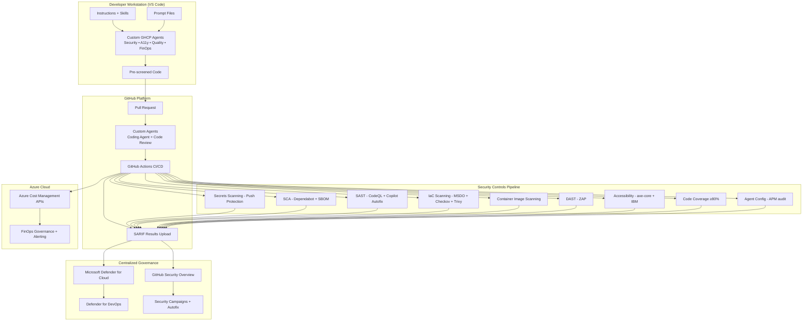
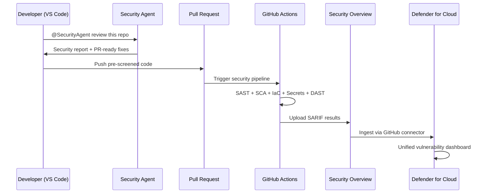

<!-- markdownlint-disable-file -->
# Task Research: Agentic DevSecOps Framework

Define a comprehensive, repeatable Agentic DevSecOps Framework that leverages custom GitHub Copilot agents, GitHub Advanced Security (GHAS), and Microsoft Defender for Cloud (MDC) to shift security and compliance left — empowering developers in both VS Code and GitHub platform to produce higher-quality, pre-screened PRs across security, accessibility, code quality, and FinOps domains.

## Task Implementation Requests

* Define the framework architecture and core patterns (custom GHCP agents, instructions, prompts, skills)
* Document security custom agents (from .github-private repo patterns)
* Document accessibility compliance agents (a11y detector/resolver, WCAG 2.2, SARIF output)
* Define code quality agents (code coverage ≥80%, SARIF reporting)
* Define cost analysis / FinOps agents (Azure SDK cost APIs, spending visualization)
* Address prompt/instruction file security (supply chain attack scanning of .md agent files)
* Integrate CI/CD pipelines (GitHub Actions + Azure DevOps) with SARIF → Security Overview → Defender for DevOps
* Define agent plugin/extensibility model (VS Code agent plugins, organization-wide skills)
* Provide implementation roadmap and proof-of-value examples

## Scope and Success Criteria

* Scope: End-to-end framework covering agent authoring, deployment (VS Code + GitHub platform + Azure DevOps), CI/CD integration, SARIF output, centralized governance via MDC/Security Overview. Covers Azure cloud primarily. Excludes AWS/GCP-specific implementations. **GitHub is the preferred platform; Azure DevOps is a first-class citizen**.
* Assumptions:
  * Organization uses GitHub Enterprise with GHAS enabled
  * VS Code is the primary IDE
  * Azure is the primary cloud provider
  * Custom agents follow `.github-private` repo patterns
  * SARIF is the standard interchange format for all scan results
* Success Criteria:
  * Clear framework architecture diagram and component catalog
  * At least 4 agent domain categories defined with implementation patterns (security, accessibility, code quality, FinOps)
  * Prompt file security scanning strategy documented
  * CI/CD integration patterns for both GitHub Actions and Azure DevOps
  * SARIF → Security Overview → Defender for Cloud data flow documented
  * Proof-of-value examples for each agent category

## Outline

1. Framework Overview and Architecture
2. Core Patterns: Custom GHCP Agents
3. Security Agents (from .github-private patterns)
4. Accessibility Compliance Agents (WCAG 2.2, SARIF)
5. Code Quality Agents (coverage, linting, SARIF)
6. FinOps / Cost Analysis Agents (Azure cost APIs)
7. Prompt File Security (supply chain attack prevention)
8. CI/CD Integration (GitHub Actions + Azure DevOps)
9. Centralized Governance (Security Overview, MDC, Defender for DevOps)
10. Agent Plugin Extensibility Model
11. Implementation Roadmap and Proof-of-Value Examples

---

## 1. Framework Overview and Architecture

### Core Formula

**Agentic DevSecOps = GitHub Advanced Security + GitHub Copilot Custom Agents + Microsoft Defender for Cloud**
*(GitHub preferred; Azure DevOps first-class citizen)*

The framework operates on a "shift-left then scale" principle:

1. **Shift Left**: Custom GHCP agents run in VS Code (IDE) before commit and in GitHub platform during PR review
2. **Automate**: CI/CD pipelines (GitHub Actions + Azure DevOps Pipelines) run the same controls as automated gates
3. **Report**: All findings output SARIF v2.1.0 for unified consumption (GitHub Code Scanning + ADO Advanced Security)
4. **Govern**: Security Overview + Defender for Cloud + Defender for DevOps + Power BI dashboards provide centralized governance

### Architecture Diagram



### Agent Domain Categories (4+)

| Domain | Agents | SARIF Category | Example Repo |
|--------|--------|---------------|--------------|
| **Security** | 6 agents (Main, Code Review, Plan, Pipeline, IaC, Supply Chain) | `security/` | `.github-private` |
| **Accessibility** | 2 agents (A11y Detector, A11y Resolver) | `accessibility-scan/` | `accessibility-scan-demo-app` |
| **Code Quality** | 2 agents (Quality Detector, Test Generator) | `code-quality/coverage/` | New |
| **FinOps** | 5 agents (Cost Analysis, Governance, Anomaly, Optimizer, Cost Gate) | `finops-finding/v1` | `cost-analysis-ai` |

---

## 2. Core Patterns: Custom GHCP Agents

### Agent Deployment Model

Custom agents deploy at three levels with lowest-level-wins precedence:

| Level | Location | Availability |
|-------|----------|-------------|
| Enterprise | `agents/` in enterprise `.github-private` | All enterprise repos |
| Organization | `agents/` in org `.github-private` | All org repos |
| Repository | `.github/agents/` in the repo | That repo only |
| User profile | `~/.copilot/agents/` | All user workspaces (VS Code) |

**Cross-platform compatibility**: The same `.agent.md` file works in VS Code, GitHub.com coding agent, GitHub CLI, and JetBrains IDEs. Omitting the `target` field enables cross-platform support.

### Agent File Specification

**File naming**: `AGENT-NAME.md` or `AGENT-NAME.agent.md`
**Max prompt length**: 30,000 characters

**YAML Frontmatter**:

```yaml
---
name: AgentName
description: "One-line description of agent purpose"
model: Claude Sonnet 4.5 (copilot)    # Optional — pin specific model
tools:                                  # Extensive tool whitelist
  - vscode/getProjectSetupInfo
  - execute/runInTerminal
  - read/readFile
  - read/problems
  - edit/editFiles
  - edit/createFile
  - search/codebase
  - search/textSearch
  - search/fileSearch
  - web/fetch
  - web/githubRepo
  - agent/runSubagent
  - todo
handoffs:                              # Optional — agent-to-agent workflow
  - label: "Fix Issues"
    agent: ResolverAgentName
    prompt: "Fix the issues identified above"
    send: false
---
```

**Body Structure Pattern**:

1. Expert persona introduction paragraph
2. Core Responsibilities (bullet list)
3. Domain-specific deep sections (checklists, rules, examples)
4. Output format specification (Markdown report templates)
5. Review process (numbered steps)
6. Severity classification (CRITICAL / HIGH / MEDIUM / LOW)
7. Reference standards (links to authoritative sources)
8. Invocation section ("Exit with a complete report. Do not wait for user input.")

### Complementary Customization Artifacts

| Artifact | Purpose | Location | Trigger |
|----------|---------|----------|---------|
| **Custom Instructions** (`.instructions.md`) | Always-on rules for files matching `applyTo` globs | `.github/instructions/` | Automatic |
| **Prompt Files** (`.prompt.md`) | Reusable task templates with input variables | Project directories | Manual reference |
| **Agent Skills** (`SKILL.md`) | On-demand domain knowledge loaded progressively | `.github/skills/` | Automatic by model |
| **copilot-instructions.md** | Repo-wide custom instructions | `.github/` | Automatic |

### Organization-Wide Sharing via `.github-private`

```text
.github-private/
├── agents/              ← Organization-wide agents (released)
│   ├── security-agent.md
│   ├── a11y-detector.agent.md
│   └── ...
├── instructions/        ← Organization-wide instructions
│   ├── wcag22-rules.instructions.md
│   └── a11y-remediation.instructions.md
└── prompts/             ← Reusable prompt templates
    ├── a11y-scan.prompt.md
    └── a11y-fix.prompt.md
```

Testing workflow: Create in `.github-private/.github/agents/` (repo-scoped) → test → move to `agents/` (org-scoped) → merge to default branch.

---

## 3. Security Agents (Proven Pattern from `.github-private`)

### Agent Inventory (6 Specialized Agents)

| Agent | File | Purpose | Output |
|-------|------|---------|--------|
| **SecurityAgent** | `security-agent.md` | Holistic security review (ASP.NET Core + IaC + CI/CD) | `security-reports/security-assessment-report.md` |
| **SecurityReviewerAgent** | `security-reviewer-agent.md` | OWASP Top 10 code-level vulnerability detection | Inline findings |
| **SecurityPlanCreatorAgent** | `security-plan-creator.agent.md` | Cloud security plan from IaC blueprints | `security-plan-outputs/security-plan-{name}.md` |
| **PipelineSecurityAgent** | `pipeline-security-agent.md` | CI/CD pipeline hardening (GH Actions + ADO) | Hardened workflow diffs |
| **IaCSecurityAgent** | `iac-security-agent.md` | Terraform/Bicep/K8s/Helm misconfiguration scanning | PR-ready fix packs |
| **SupplyChainSecurityAgent** | `supply-chain-security-agent.md` | Secrets, dependencies, SBOM, governance | Security Report + PR Changes + Backlog |

### Agent Cross-Reference Map

```text
SecurityAgent (holistic orchestrator)
├── delegates → SecurityReviewerAgent (application code)
├── delegates → PipelineSecurityAgent (CI/CD YAML)
├── delegates → IaCSecurityAgent (infrastructure)
└── delegates → SupplyChainSecurityAgent (supply chain)

SupplyChainSecurityAgent
├── out-of-scope → SecurityReviewerAgent (app code)
├── out-of-scope → PipelineSecurityAgent (CI/CD)
└── out-of-scope → IaCSecurityAgent (IaC)
```

### Security Agent Design Patterns

* **Model pinning**: All agents pin `model: Claude Sonnet 4.5 (copilot)` for consistent behavior
* **Comprehensive tool declarations**: ~40 tools per agent covering VS Code, execution, read, edit, search, web, and agent namespaces
* **Autonomous execution**: Agents complete analysis and exit with full report, no user interaction required
* **Severity framework**: Consistent CRITICAL/HIGH/MEDIUM/LOW with CWE/OWASP mapping
* **PR-ready output**: Unified diff patches, fix packs, and change justification checklists
* **Compliance mapping**: CIS Azure, NIST 800-53, Azure Security Benchmark, PCI-DSS

### CI/CD Security Pipeline (8 Domains)

| Domain | Tools | SARIF Output |
|--------|-------|-------------|
| Secrets Scanning | GitHub Secret Protection, Copilot Secret Scanning, Custom Patterns | Auto |
| SCA | Dependabot, Dependency Review, Artifact Attestations, SBOM (Anchore Syft, Microsoft SBOM) | Workflow |
| SAST | CodeQL (Default + Advanced), Copilot Autofix, 3rd-party tools | Workflow |
| IaC Scanning | MSDO (Checkov, Template Analyzer, Terrascan, KICS, tfsec, Trivy) | Workflow |
| Container Image Scanning | MSDO (Checkov, Terrascan, Trivy, Anchore Grype) | Workflow |
| DAST | ZAP by Checkmarx | Workflow |
| Continuous Scanning | Microsoft Defender for Cloud, Sentinel, Azure Policy | Auto |
| Compliance Check | Custom compliance agents + SARIF upload | Workflow |

---

## 4. Accessibility Compliance Agents (WCAG 2.2, SARIF)

### Three-Engine Scanner Architecture (from `accessibility-scan-demo-app`)

| Engine | Technology | Coverage |
|--------|-----------|----------|
| **axe-core** (primary) | `@axe-core/playwright`, Playwright Chromium | WCAG 2.0-2.2 A/AA + best-practice |
| **IBM Equal Access** (secondary) | `accessibility-checker`, isolated Playwright context | Additional WCAG rules |
| **Custom Playwright checks** (5 checks) | `page.evaluate()` DOM inspection | ambiguous-link-text, aria-current-page, emphasis-strong-semantics, discount-price-accessibility, sticky-element-overlap |

### SARIF Integration

**axe-core → SARIF v2.1.0 mapping**:

| axe-core Impact | SARIF Level | security-severity |
|----------------|-------------|-------------------|
| critical | error | 9.0 |
| serious | error | 7.0 |
| moderate | warning | 4.0 |
| minor | note | 1.0 |

Key SARIF enrichment: `help.markdown` with WCAG mapping + remediation, `properties.tags` with `accessibility` + WCAG SC tags, `partialFingerprints` for deduplication, `automationDetails.id` category `accessibility-scan/<url>`.

### A11y Agent Pair (Detector ↔ Resolver)

**A11y Detector** (`a11y-detector.agent.md`):
* 5-step protocol: Scope → Static Analysis → Runtime Scanning → Report → Handoff
* Static analysis of HTML/JSX/TSX (missing alt, labels, heading hierarchy, ARIA)
* CSS/Tailwind analysis (contrast, focus styles, target sizes 24×24px)
* Runtime scanning via `npx a11y-scan` CLI
* POUR principle breakdown with weighted scoring
* Handoff to A11y Resolver

**A11y Resolver** (`a11y-resolver.agent.md`):
* 6-step protocol: Identify → Analyze → Apply Fixes → Verify → Report → Handoff
* 18-row remediation lookup table (violation ID → WCAG SC → standard fix)
* React/Next.js specific patterns (`useId()`, `<Image alt>`, layout.tsx lang)
* Handoff back to A11y Detector for verification re-scan

**Supporting files**:
* `instructions/wcag22-rules.instructions.md` — Auto-applied to TSX/JSX/TS/HTML/CSS via `applyTo`
* `instructions/a11y-remediation.instructions.md` — Remediation patterns
* `prompts/a11y-scan.prompt.md` — Quick-invoke scan shortcut
* `prompts/a11y-fix.prompt.md` — Quick-invoke fix shortcut

### Compliance Control Patterns

| Pattern | Implementation |
|---------|---------------|
| Threshold gating | CI fails when score < 70 or critical/serious > 0 |
| SARIF → Security Overview | Upload via `github/codeql-action/upload-sarif@v4` |
| Scheduled scanning | Weekly cron scans production URLs |
| Multi-site matrix | Matrix strategy scans multiple URLs with per-site SARIF categories |
| Config-as-code | `.a11yrc.json` per-project standards |
| Agent-assisted triage | Detector finds → Resolver fixes → re-scan verification |
| Defender for Cloud rollup | GitHub SARIF → Defender for Cloud via GitHub connector |

---

## 5. Code Quality Agents (Coverage, SARIF)

### Proposed Agent Architecture (Modeled on A11y Pattern)

**Code Quality Detector Agent**:
* Reads coverage reports (lcov, cobertura, JSON)
* Identifies files/functions below 80% threshold
* Reports complexity, duplication, lint violations
* Generates structured findings by priority
* Handoff to Test Generator Agent

**Test Generator Agent**:
* Reads source code for uncovered functions
* Generates tests covering happy path + error paths
* Uses existing test patterns from codebase
* Runs tests and re-measures coverage
* Handoff back to Quality Detector for verification

### Coverage-to-SARIF Mapping

| Coverage Concept | SARIF Mapping |
|-----------------|---------------|
| Uncovered function | `result` with `ruleId: "uncovered-function"` |
| Uncovered branch | `result` with `ruleId: "uncovered-branch"` |
| File below threshold | `result` with `ruleId: "coverage-threshold-violation"` |
| Uncovered line range | `physicalLocation.region` with startLine/endLine |

Report only **regressions** and **below-threshold** functions as SARIF results (not full coverage) to stay within GitHub's 25,000-result limit.

`automationDetails.id` category: `code-quality/coverage/`

### Multi-Language Coverage Tools

| Language | Tool | Formats |
|----------|------|---------|
| JavaScript/TypeScript | Vitest, Jest, c8, Istanbul | lcov, cobertura, JSON |
| Python | coverage.py, pytest-cov | lcov, XML, JSON |
| .NET/C# | dotnet test + coverlet | cobertura, opencover, lcov |
| Java | JaCoCo, Cobertura | XML, HTML, CSV |
| Go | `go test -coverprofile` | Go cover profile → lcov |

### Quality Gate Pattern

```yaml
jobs:
  quality:
    steps:
      - run: npm run lint
      - run: npx tsc --noEmit
      - run: npm run test:ci  # vitest run --coverage
      - name: Coverage threshold check  # fail if < 80%
      - name: Convert coverage to SARIF
      - uses: github/codeql-action/upload-sarif@v4
        with:
          sarif_file: coverage-results.sarif
          category: code-quality/coverage
```

---

## 6. FinOps / Cost Analysis Agents (Azure Cost APIs)

### Reference Implementation: `cost-analysis-ai`

Architecture: Azure Policy tag enforcement (7 tags) → Tag inheritance → Cost Management Query API → PDF/A-3B invoices + D365 CSV + Excel + JSON. Deployed as Azure Function with Timer + HTTP triggers, authenticated via Managed Identity with Cost Management Reader role.

### Azure Cost Management APIs

| API | Purpose | SDK |
|-----|---------|-----|
| Cost Management Query | Ad-hoc cost queries by tag/resource group/service | `azure-mgmt-costmanagement>=4.0.1` |
| Budgets | Create/manage cost budgets with alerts | Consumption API |
| Exports | Recurring CSV to Azure Storage | Cost Management |
| Scheduled Actions | Anomaly detection alert rules (WaveNet) | Cost Management |
| Forecasts | Project future costs | Cost Management |
| Azure Advisor | Optimization recommendations | Resource Graph |

### Proposed FinOps Agent Family (5 Agents)

| Agent | Purpose | Trigger |
|-------|---------|---------|
| **CostAnalysisAgent** | Query costs and generate reports | User query, scheduled |
| **FinOpsGovernanceAgent** | Tag compliance monitoring and scoring | Scheduled daily/weekly |
| **CostAnomalyDetectorAgent** | Anomaly detection and investigation | Anomaly webhook, daily check |
| **CostOptimizerAgent** | Surface Azure Advisor recommendations | Weekly scheduled |
| **DeploymentCostGateAgent** | Block deployments exceeding budget | PR IaC changes |

### FinOps Finding Schema (SARIF-Inspired)

Categories: `budget-overspend`, `cost-anomaly`, `untagged-resources`, `idle-resources`, `reservation-waste`, `cost-trend`, `optimization-opportunity`

### Repository-to-Cost Attribution

1. Apply `ProjectName=<repo-name>` tag at deployment
2. Enable Azure Policy tag inheritance
3. Enable Cost Management virtual tag inheritance
4. Query Cost Management API grouped by `ProjectName`

---

## 7. Prompt File Security (Supply Chain Attack Prevention)

### The Blind Spot

Agent configuration files (`.instructions.md`, `.agent.md`, `.prompt.md`, `copilot-instructions.md`, `AGENTS.md`) are **auto-consumed as trusted system instructions** by AI coding agents but are **not covered by standard SAST/SCA/DAST tools**. This is a critical supply chain attack vector.

Daniel Meppiel ([@danielmeppiel](https://github.com/danielmeppiel)), creator of Microsoft's APM (Agent Package Manager), identified this gap and built **content security scanning directly into APM** as a first-class feature. His LinkedIn article "Scan Your Coding Agent's Configuration for Hidden Supply Chain Attacks" details the threat model. APM's `apm audit` and install-time scanning represent the first dedicated tooling to address this attack surface.

### APM – Agent Package Manager (`microsoft/apm`)

APM is an open-source dependency manager for AI agents (MIT license, v0.8.0). Think `package.json` but for AI agent configuration — instructions, skills, prompts, agents, hooks, plugins, and MCP servers. APM is a critical complement to the Agentic DevSecOps Framework because it solves both **dependency management** and **supply chain security** for agent configurations.

**Core capabilities**:
* `apm.yml` manifest declares all agentic dependencies (like `package.json` for agents)
* Transitive dependency resolution — packages can depend on packages
* Install from any Git host (GitHub, GitLab, Bitbucket, Azure DevOps, GitHub Enterprise)
* `apm compile` produces `AGENTS.md` (GitHub Copilot), `CLAUDE.md` (Claude Code), `.cursor/rules/` (Cursor)
* `apm audit` scans for hidden Unicode characters that embed invisible instructions
* `apm install` blocks compromised packages **before** agents can read them
* `apm pack` bundles configurations for distribution with built-in security scanning
* [GitHub Action](https://github.com/microsoft/apm-action) for CI/CD automation

**Content security scanning (`apm audit`)**:

| Severity | Detections |
|----------|------------|
| **Critical** | Tag characters (U+E0001–E007F), bidi overrides (U+202A–E, U+2066–9), variation selectors 17–256 (U+E0100–E01EF — Glassworm attack vector) |
| **Warning** | Zero-width spaces/joiners (U+200B–D), variation selectors 1–15 (U+FE00–FE0E), bidi marks (U+200E–F, U+061C), invisible operators (U+2061–4), annotation markers (U+FFF9–B), deprecated formatting (U+206A–F), soft hyphen (U+00AD), mid-file BOM |
| **Info** | Non-breaking spaces, unusual whitespace, emoji presentation selector (U+FE0F). ZWJ between emoji characters is context-downgraded to info |

**Exit codes**: 0 = clean, 1 = critical findings, 2 = warnings only

**Defense-in-depth**: Content scanning runs at three points:
1. `apm install` — blocks compromised packages before deployment (critical findings block; use `--force` to override)
2. `apm audit` — on-demand scanning of installed packages or arbitrary files
3. `apm compile` — scans compiled output before writing to disk

```bash
# Scan all installed packages
apm audit

# Scan a specific file (even non-APM-managed)
apm audit --file .github/copilot-instructions.md

# Remove dangerous characters (preserves emoji)
apm audit --strip

# Preview what --strip would remove
apm audit --strip --dry-run
```

**APM in CI/CD** (via `microsoft/apm-action`):

```yaml
# .github/workflows/apm-security.yml
name: APM Security Scan
on:
  pull_request:
    paths:
      - 'apm.yml'
      - '.github/agents/**'
      - '.github/instructions/**'
      - '.github/prompts/**'
      - '**/*.agent.md'
      - '**/*.instructions.md'
      - '**/*.prompt.md'
jobs:
  audit:
    runs-on: ubuntu-latest
    steps:
      - uses: actions/checkout@v4
      - uses: microsoft/apm-action@v1
        with:
          command: audit
```

### Attack Categories

| Attack | Example | Risk |
|--------|---------|------|
| Indirect prompt injection | Hidden instructions altering agent behavior | Agent follows invisible commands |
| Tool/MCP server manipulation | Unauthorized MCP servers in agent YAML | External code execution |
| YAML frontmatter weaponization | Overly broad `applyTo: "**"` with malicious rules | All files in repo affected |
| Hook code execution | Shell commands in hook configurations | Arbitrary code execution |
| Unicode injection | Zero-width characters embedding hidden instructions | Invisible manipulation |
| Plugin marketplace attacks | Malicious agent plugins mimicking legitimate ones | Supply chain compromise |

### OWASP LLM Top 10 Alignment

| OWASP Risk | Relevance |
|-----------|-----------|
| **LLM01** Prompt Injection | Direct — malicious instructions in config files |
| **LLM03** Supply Chain | Direct — config files are part of the LLM supply chain |
| **LLM06** Excessive Agency | Config files define tool access and autonomy level |
| **LLM07** System Prompt Leakage | Config files are system prompts; leaked = architecture exposed |

### Recommended Security Controls

**CODEOWNERS Protection**:

```text
.github/copilot-instructions.md @security-team
.github/instructions/ @security-team
.github/agents/ @security-team
**/AGENTS.md @security-team
```

**CI Pipeline Scanning** (scan for):
* Base64-encoded strings (hidden instructions)
* Zero-width Unicode characters (U+200B, U+200C, U+200D, U+FEFF)
* URLs to untrusted external servers
* Shell command patterns (`&&`, `|`, `;`, backticks, `$()`)
* Instructions to "ignore", "override", "bypass" previous instructions
* MCP server configurations against an allowlist
* Hook definitions executing shell commands
* Overly broad `applyTo` patterns

**GitHub Actions Workflow**:

```yaml
name: Agent Configuration Security Scan
on:
  pull_request:
    paths:
      - '.github/copilot-instructions.md'
      - '.github/instructions/**'
      - '.github/agents/**'
      - '**/*.instructions.md'
      - '**/*.agent.md'
      - '**/*.prompt.md'
      - '**/AGENTS.md'
      - '**/SKILL.md'
```

**Available Scanner Tools**:
* **`microsoft/apm` (recommended)** — APM's built-in `apm audit` command provides dedicated content security scanning for agent configuration files, detecting hidden Unicode, bidi overrides, tag characters, and Glassworm attack vectors. First-class, purpose-built tool for this exact threat. Created by Daniel Meppiel.
* `protectai/llm-guard` — prompt injection detection (adaptable to agent config scanning)
* `deadbits/vigil-llm` — YARA-based prompt injection detection
* `NVIDIA/NeMo-Guardrails` — LLM guardrails
* `protectai/rebuff` — self-hardening prompt injection detector

---

## 8. CI/CD Integration (GitHub Actions + Azure DevOps)

### GitHub Actions: Unified SARIF Pipeline

All scan tools output SARIF v2.1.0 and upload via `github/codeql-action/upload-sarif@v4` with distinct `automationDetails.id` categories:

| Scan Type | SARIF Category | Tool |
|-----------|---------------|------|
| Secrets | `secret-scanning/` | GitHub Secret Protection |
| SCA | `dependency-review/` | Dependabot |
| SAST | `codeql/` | CodeQL + Copilot Autofix |
| IaC | `iac-scanning/` | MSDO (Checkov, Trivy) |
| Container | `container-scanning/` | Trivy, Grype |
| DAST | `dast/` | ZAP |
| Accessibility | `accessibility-scan/` | axe-core + IBM |
| Code Coverage | `code-quality/coverage/` | Coverage-to-SARIF converter |
| Agent Config | `agent-config-scan/` | APM (`microsoft/apm`) `apm audit` |
| FinOps | `finops-finding/` | Cost analysis agent |

**SARIF Requirements for GitHub**:
* `$schema` and `version: '2.1.0'` — required
* `tool.driver.name` and `tool.driver.rules[]` — required
* `help.text` required; `help.markdown` recommended (GitHub renders markdown)
* `partialFingerprints` — required for deduplication
* Max: 10MB gzip, 25K results/run, 20 runs/file

### Azure DevOps Pipeline

GHAS for ADO (GitHub Advanced Security for Azure DevOps) provides code scanning, dependency scanning, and secret scanning natively within ADO. SARIF results from custom tools (e.g., accessibility scanner) can be published to ADO Advanced Security via the `AdvancedSecurity-Publish@1` task or to Defender for DevOps via the ADO connector.

```yaml
# Secret scanning + dependency scanning + code scanning (GHAS for ADO)
- task: AdvancedSecurity-Codeql-Init@1
  inputs:
    languages: 'csharp'
    enableAutomaticCodeQLInstall: true

- task: AdvancedSecurity-Dependency-Scanning@1

- task: AdvancedSecurity-Codeql-Analyze@1

# Custom accessibility scanning → ADO Advanced Security
- script: npx a11y-scan scan --url "$(SCAN_URL)" --threshold 80 --format sarif --output a11y-results.sarif
- task: AdvancedSecurity-Publish@1
  inputs:
    sarif_file: a11y-results.sarif

# Quality: JUnit + Cobertura for native ADO test/coverage
- task: PublishTestResults@2
  inputs:
    testResultsFormat: 'JUnit'
    failTaskOnFailedTests: true

- task: PublishCodeCoverageResults@2
  inputs:
    codeCoverageTool: 'Cobertura'
    summaryFileLocation: '$(Build.SourcesDirectory)/coverage/cobertura-coverage.xml'
```

SARIF results uploaded to ADO Advanced Security appear in the ADO Code Scanning tab (filterable by tool — e.g., `accessibility-scanner`, `CodeQL`) and flow to Defender for Cloud via the ADO connector.

### Azure DevOps as a First-Class Platform

While GitHub is the preferred platform for this framework, **Azure DevOps is a first-class citizen** with GitHub Advanced Security for Azure DevOps (GHAzDO) providing core security scanning capabilities. Many organizations operate in a hybrid GitHub + ADO environment, and this framework supports both.

**GHAzDO includes**:
* **Secret Protection**: Push protection + secret scanning alerts + Security Overview
* **Code Security**: CodeQL scanning + dependency scanning + third-party tool findings + Security Overview
* **PR annotations**: Automatic annotations for dependency and code scanning on pull requests with build validation policies
* **Organization/project/repo-level enablement**: Same hierarchical enablement as GitHub

**Key differences from GitHub**:
* GHAzDO uses **pipeline tasks** (`AdvancedSecurity-Codeql-Init@1`, `AdvancedSecurity-Codeql-Analyze@1`, `AdvancedSecurity-Dependency-Scanning@1`) instead of GitHub Actions
* Third-party SARIF results published via `AdvancedSecurity-Publish@1` task (including accessibility scan results)
* ADO Security Overview is **UI-only** (no API) — compensated by Power BI dashboards (see below)
* Custom GHCP agents are not natively available in ADO — but VS Code agents work when developing ADO-hosted code
* ADO Advanced Security REST API at `advsec.dev.azure.com` (separate domain from `dev.azure.com`)

### Platform Feature Comparison

| Framework Feature | GitHub | Azure DevOps | Notes |
|-------------------|--------|-------------|-------|
| **Secret Scanning** | ✅ GitHub Secret Protection | ✅ GHAzDO Secret Protection | Push protection on both |
| **Dependency Scanning (SCA)** | ✅ Dependabot + Dependency Review | ✅ GHAzDO Dependency Scanning | ADO uses pipeline task |
| **Code Scanning (SAST)** | ✅ CodeQL + Copilot Autofix | ✅ GHAzDO CodeQL | Same CodeQL engine on both |
| **SARIF Upload (custom tools)** | ✅ `upload-sarif` action | ✅ `AdvancedSecurity-Publish@1` | A11y scanner works on both |
| **IaC Scanning** | ✅ MSDO GitHub Action | ✅ MSDO ADO Task | Same MSDO tool on both |
| **DAST** | ✅ ZAP GitHub Action | ✅ ZAP ADO Task | Same ZAP tool on both |
| **Security Overview** | ✅ Org-wide dashboard + API | ⚠️ Org-level UI-only (no API) | ADO compensated by Power BI |
| **Security Campaigns** | ✅ Bulk remediation + Autofix | ❌ Not available | GitHub-only feature |
| **Copilot Autofix** | ✅ AI-powered fix suggestions | ❌ Not available | GitHub-only feature |
| **Custom GHCP Agents (platform)** | ✅ Coding agent + agents tab | ❌ Not on ADO platform | Use VS Code agents for ADO repos |
| **Custom GHCP Agents (IDE)** | ✅ VS Code + JetBrains | ✅ VS Code (for ADO repos) | Same agents work in VS Code |
| **Agent Instructions/Prompts** | ✅ `.github/` conventions | ✅ Via VS Code (same files) | Agents run locally in IDE |
| **PR Annotations** | ✅ Inline SARIF annotations | ✅ Build validation annotations | Both support inline feedback |
| **Defender for Cloud integration** | ✅ GitHub connector | ✅ ADO connector | Both feed into MDC |
| **Defender for DevOps** | ✅ GitHub repos visible | ✅ ADO repos visible | Unified view across both |
| **Container Image Scanning** | ✅ Trivy/Grype actions | ✅ Trivy/MSDO pipeline tasks | Same tools available |
| **Accessibility SARIF → AdvSec** | ✅ Code Scanning alerts | ✅ Code Scanning alerts (ADO) | Proven: a11y-scanner visible in ADO |
| **Code Coverage reporting** | ✅ SARIF + PR comments | ✅ PublishCodeCoverageResults | ADO has native coverage tab |
| **Power BI Security Dashboards** | ⚠️ Via API (custom build) | ✅ `advsec-pbi-report-ado` | ADO has dedicated PBI report |
| **FinOps / Cost Analysis** | ✅ GitHub Actions + Azure SDK | ✅ ADO Pipelines + Azure SDK | Same Azure APIs from both |
| **APM dependency management** | ✅ `apm install` + `apm audit` | ✅ Works with any Git host | APM supports ADO repos |
| **SBOM generation** | ✅ Anchore Syft / Microsoft SBOM | ✅ Same tools in ADO pipelines | Pipeline-agnostic tools |

### Power BI Dashboards for ADO Advanced Security (`advsec-pbi-report-ado`)

The `devopsabcs-engineering/advsec-pbi-report-ado` repository provides a **Power BI report in PBIP format** that compensates for ADO's lack of Security Overview API. This report provides richer analytics than the native ADO Security Overview UI and complements Microsoft Defender for Cloud dashboards.

**Architecture**:
* Data source: ADO Advanced Security REST API at `advsec.dev.azure.com` (API v7.2-preview.1)
* Authentication: PAT with `vso.advsec` scope
* Star schema: 1 fact table (`Fact_SecurityAlerts`) + 5 dimension tables (`Dim_AlertType`, `Dim_Date`, `Dim_Repository`, `Dim_Severity`, `Dim_State`)
* Parameterized: `OrganizationName` + optional `ProjectName` for multi-org deployment
* Pagination: Continuation token-based enumeration across all projects → repos → alerts

**Report pages** (from the attached Power BI screenshot):
* **Security Overview**: DevOps Security Findings donut charts, Code Scanning/Dependency/Secret finding breakdowns, severity distribution, alerts by tool (CodeQL, Advanced Security, templateanalyzer, trivy)
* **Alerts by Type**: Breakdown by dependency, secret, and code alerts
* **Trend Analysis**: Alert trends over time

**Key metrics** (DAX measures):
* Total Alerts, Active Alerts, Fixed Alerts, Fixed Rate %, Critical Active, Mean Time to Fix
* Alert counts by type: Dependency Alerts, Secret Alerts, Code Alerts

**Deployment**:
```powershell
# Configure for your ADO org
.\scripts\setup-parameters.ps1 -OrganizationName "yourorg"
# Open in Power BI Desktop
Start-Process AdvSecReport.pbip
# Automated deployment to Fabric workspace
.\scripts\deploy.ps1
```

**Value in the framework**: This Power BI report provides the "Security Overview at scale" capability that ADO lacks natively, enabling governance teams to see security posture across 20+ projects and 40+ repos (as shown in the attached screenshot with 1,394 total alerts across all severity levels). Combined with Defender for Cloud, this creates comprehensive security governance for ADO-hosted repositories.

---

## 9. Centralized Governance (Security Overview, MDC, Defender for DevOps)

### Data Flow

```text
Scan Tools → SARIF Upload → GitHub Code Scanning → Security Overview
                                                  ↓
                                     Defender for Cloud (GitHub Connector)
                                                  ↓
                                     Defender for DevOps Console
                                                  ↓
                                     Unified Vulnerability Management
```

### GitHub Security Overview

* Org-wide dashboard of all code scanning alerts across repositories
* Filter by severity, rule, category (tag-based via SARIF `properties.tags`)
* Enables **Security Campaigns** — bulk remediation of vulnerabilities with Copilot Autofix

### Microsoft Defender for Cloud

* Extends security posture to include GenAI workloads
* Attack path analysis for misconfigurations and vulnerabilities
* DevOps security insights across **GitHub, ADO, and GitLab**
* Ingests Code Scanning alerts from onboarded GitHub repositories **and** ADO repositories
* Accessibility, coverage, and FinOps findings appear alongside security alerts
* ADO Advanced Security alerts visible in Defender for DevOps console (as shown in attached ADO screenshot: accessibility-scanner and CodeQL findings in ADO Advanced Security → Defender for Cloud)

### Integration Requirements

* GitHub Advanced Security (GHAS) enabled or public repository (GitHub)
* GitHub Advanced Security for Azure DevOps (GHAzDO) enabled (ADO)
* GitHub organization connected to Defender for Cloud via GitHub connector
* ADO organization connected to Defender for Cloud via ADO connector
* `security-events: write` permission in CI workflows (GitHub)
* SARIF files compliant with platform-specific requirements

### Complementary Dashboards

| Dashboard | Platform | Capabilities | Gaps Addressed |
|-----------|----------|-------------|----------------|
| **GitHub Security Overview** | GitHub | Org-wide alerts, filter by severity/rule/category, Security Campaigns | N/A — full-featured |
| **ADO Security Overview** | ADO | Org-level risk + coverage tabs | UI-only, no API, limited customization |
| **Power BI AdvSec Report** | ADO | Star schema, DAX measures, multi-org, trend analysis, Mean Time to Fix | Compensates for ADO Security Overview API gap |
| **Defender for Cloud** | Both | Unified cross-platform view, attack path analysis, runtime protection | N/A — aggregates both |
| **Defender for DevOps** | Both | DevOps-specific findings across GitHub + ADO + GitLab | N/A — cross-platform |

### Data Flow (Dual Platform)

```text
GitHub:
  Scan Tools → SARIF Upload → GitHub Code Scanning → Security Overview
                                                    ↓
                                       Defender for Cloud (GitHub Connector)
                                                    ↓
                                       Defender for DevOps Console

Azure DevOps:
  Pipeline Tasks → SARIF → ADO Advanced Security → ADO Security Overview (UI)
                                                  ↓
                                     Defender for Cloud (ADO Connector)
                                                  ↓
                                     Defender for DevOps Console
                                                  ↓
                              Power BI AdvSec Report (advsec-pbi-report-ado)
```

---

## 10. Agent Plugin Extensibility Model

### Agent Plugin Architecture (VS Code)

Agent plugins are prepackaged bundles installable from Git-based marketplaces:

```text
my-devsecops-plugin/
  plugin.json              # Plugin metadata
  skills/
    security-scan/SKILL.md # Security scanning skill
    a11y-scan/SKILL.md     # Accessibility scanning skill
  agents/
    security-agent.md      # Security review agent
    a11y-detector.agent.md # A11y detection agent
  hooks/
    post-commit.json       # Post-commit security check
```

### Plugin Marketplaces

* Default: `github/copilot-plugins`, `github/awesome-copilot`
* Custom: Configure via `chat.plugins.marketplaces` (supports private repos)
* Local: Register via `chat.plugins.paths`

### Extensibility Comparison

| Feature | Distribution | Portability | Content |
|---------|-------------|-------------|---------|
| Custom Agent | `.github-private` or repo | VS Code + GitHub.com + CLI | Persona + tools |
| Agent Skill | `.github/skills/` | VS Code + GitHub.com + CLI | Instructions + scripts |
| Agent Plugin | Git marketplace | VS Code only | Bundle of all above |
| MCP Server | Agent YAML or repo config | GitHub.com (agent YAML), VS Code (settings) | External tools |
| Custom Instructions | `.github/instructions/` | VS Code + GitHub.com | Always-on rules |
| **APM Package** | `apm.yml` manifest + any Git host | All agents (Copilot, Claude, Cursor, OpenCode) | Bundle with dependency resolution + security scanning |

### Organization-Scale Agent Sharing

| Mechanism | Reach | Control |
|-----------|-------|---------|
| Enterprise `.github-private` | All enterprise repos | Enterprise owners + rulesets |
| Org `.github-private` | All org repos | Org owners |
| Agent plugins (private marketplace) | Install per user | Marketplace admin |
| Reusable workflows | Per repo (uses reference) | Workflow author |

---

## 11. Implementation Roadmap and Proof-of-Value Examples

### Phase 1: Security Agents (Already Proven)

* **Status**: ✅ Implemented in `devopsabcs-engineering/.github-private`
* **Agents**: SecurityAgent, SecurityReviewerAgent, SecurityPlanCreatorAgent, PipelineSecurityAgent, IaCSecurityAgent, SupplyChainSecurityAgent
* **Proof of value**: Demonstrated at TT343 session with live demo using `gh-advsec-devsecops` repo
* **Action**: Roll out organization-wide via `.github-private`, enable in VS Code, configure CI SARIF upload

### Phase 2: Accessibility Agents (Already Proven)

* **Status**: ✅ Implemented — scanner in `accessibility-scan-demo-app`, agents in `.github-private`
* **Agents**: A11y Detector, A11y Resolver
* **Proof of value**: Three-engine scanner with SARIF output, CI integration, WCAG 2.2 AA compliance, Defender for Cloud rollup
* **Action**: Onboard additional applications for accessibility scanning, add scheduled production scans

### Phase 3: Code Quality Agents (New)

* **Status**: 🆕 Pattern defined, ready for implementation
* **Agents**: Code Quality Detector, Test Generator
* **Implementation pattern**: Follow A11y Detector/Resolver pattern with coverage-to-SARIF conversion
* **Key deliverable**: Agent that enforces ≥80% code coverage, reports below-threshold functions in SARIF
* **Action**: Create `code-quality-detector.agent.md` and `test-generator.agent.md` in `.github-private`

### Phase 4: FinOps / Cost Analysis Agents (New)

* **Status**: 🆕 Pattern defined, reference implementation in `cost-analysis-ai`
* **Agents**: CostAnalysisAgent, FinOpsGovernanceAgent, CostAnomalyDetectorAgent, CostOptimizerAgent, DeploymentCostGateAgent
* **Implementation pattern**: Leverage Azure Cost Management SDK + existing invoice generation code
* **Key deliverable**: Agent that queries Azure costs, reports anomalies, gates deployments on budget
* **Action**: Create agent definitions, integrate with Azure Cost Management APIs, add CI cost gate

### Phase 5: Prompt File Security (New — Critical)

* **Status**: 🆕 Research complete, **dedicated tooling available** via `microsoft/apm`
* **Key deliverable**: Integrate APM `apm audit` into CI/CD via `microsoft/apm-action` to scan all agent config file changes for hidden Unicode supply chain attacks; complement with CODEOWNERS protection
* **Action**: Install APM (`apm install`), add `microsoft/apm-action` to CI workflows, establish CODEOWNERS for agent config directories, adopt `apm.yml` manifest for dependency management of agent configurations

### Cross-Cutting: Centralized Governance

* Onboard all org repositories to Defender for Cloud via GitHub connector
* Configure unified SARIF categories across all scan types
* Enable Security Campaigns for bulk remediation
* Create Defender for DevOps dashboards combining security + accessibility + quality + cost findings

---

## Potential Next Research

* Investigate Agent Skills open standard at agentskills.io
* **Evaluate APM adoption** — integrate `microsoft/apm` as the dependency manager for the framework's agent configurations; assess `apm.yml` manifest patterns for declaring security, accessibility, code quality, and FinOps agent dependencies
* Research APM enterprise features: [Security Model](https://microsoft.github.io/apm/enterprise/security/), [Governance & Compliance](https://microsoft.github.io/apm/enterprise/governance/), [APM for Teams](https://microsoft.github.io/apm/enterprise/teams/)
* Investigate APM + GitHub Rulesets integration for agent file protection
* **Research ADO Advanced Security REST API** for building custom reporting and automation beyond Power BI (API at `advsec.dev.azure.com`, v7.2-preview.1)
* **Investigate ADO ↔ GitHub migration patterns** for organizations moving between platforms while maintaining security posture
* Research the `AdvancedSecurity-Publish@1` ADO task for publishing custom SARIF (accessibility, coverage) to ADO Advanced Security
* Research `protectai/llm-guard` and `deadbits/vigil-llm` as complementary semantic scanning (beyond Unicode detection)
* Explore MCP server authoring patterns for custom tool development
* Research OWASP CycloneDX AI BOM for agent configuration tracking
* Investigate FOCUS (FinOps Open Cost and Usage Specification) for multi-cloud cost data
* Research Azure Advisor REST API for programmatic cost recommendations
* Research "rules file backdoor" attack techniques and mitigations (Glassworm and similar vectors)
* Evaluate SonarQube SARIF export for code quality metrics
* Research cross-language coverage aggregation for monorepos
* Investigate Azure Cost Management MCP server possibilities

---

## Research Executed

### PPTX Analysis: TT343 - Agentic AI for DevSecOps

Key findings from the presentation (slides 67-93):

* **Slide 76-77**: Agents across the entire software lifecycle — coding agent, code review, code quality, app modernization, SRE agent, custom agents
* **Slide 80**: Six Security GHCP Custom Agents defined (SecurityMainAgent, SecurityCodeReviewAgent, SecurityPlanCreationAgent, SecurityPipelineAgent, SecurityIaCAgent, SecuritySupplyChainAgent)
* **Slide 81**: Shift Left into VS Code — Same agents available in VS Code before commit/PR
* **Slide 84-85**: DevSecOps Guidelines covering 8 security domains with GHAS + MSDO + MDC
* **Slide 70**: GHAS + MDC integration — AI-powered security from code to runtime
* **Slide 79**: Agentic DevSecOps = GHAS + GHCP + MDC
* **Slide 90-91**: Scalable end-to-end DevSecOps blueprint

### PPTX Analysis: Accessibility Compliance at Scale

* Solution B: "Knocking it out of the park" — scanner built from scratch using RPI flow, SARIF output, CI integration
* Reference: `devopsabcs-engineering/accessibility-scan-demo-app`, axe-core, IBM equal-access, Playwright
* First version built in 1.5 hours using GitHub Copilot

### PDF Analysis: Scan Your Coding Agent's Configuration for Hidden Supply Chain Attacks

* LinkedIn article by Daniel Meppiel ([@danielmeppiel](https://github.com/danielmeppiel)) — agent configuration files as supply chain attack vectors
* Key: `.instructions.md`, `.agent.md`, `.prompt.md` files can contain hidden prompt injection
* Daniel Meppiel is the creator of **APM (Agent Package Manager)** at `microsoft/apm`, which includes built-in content security scanning (`apm audit`) to detect hidden Unicode characters in agent configuration files

### Subagent Research: `.github-private` Repository Agents

* 8 agents identified: 6 security + 2 accessibility
* Consistent patterns: YAML frontmatter, ~40 tool whitelist, model pinning, autonomous execution
* Supporting: 2 instruction files, 2 prompt files
* Agent cross-reference map with clear scope boundaries

### Subagent Research: Prompt File Security

* 6 attack categories identified for agent configuration files
* 4 OWASP LLM Top 10 risks directly apply (LLM01, LLM03, LLM06, LLM07)
* **APM (`microsoft/apm`) identified as the dedicated scanner** — `apm audit` provides first-class content security scanning for hidden Unicode, bidi overrides, tag characters, and Glassworm attack vectors; created by Daniel Meppiel
* Recommended: APM install-time scanning + `apm audit` CI integration + CODEOWNERS + MCP allowlisting + plugin vetting

### Subagent Research: GHCP Agent Plugins & Extensibility

* Agent plugins = prepackaged bundles via Git marketplaces (VS Code only)
* Custom agents work cross-platform (VS Code + GitHub.com + CLI)
* Organization sharing via `.github-private` with three-level hierarchy
* MCP servers as primary external tool extensibility mechanism
* Enterprise rulesets for agent profile protection

### Subagent Research: Accessibility & Code Quality

* Three-engine scanner: axe-core + IBM Equal Access + 5 custom Playwright checks
* SARIF v2.1.0 mapping with full GitHub Code Scanning support
* A11y Detector ↔ Resolver bi-directional handoff pattern
* Coverage-to-SARIF mapping feasible (report uncovered functions/branches as findings)
* Multi-language coverage tools: Vitest/Jest, coverage.py, coverlet, JaCoCo

### Subagent Research: Azure Cost Analysis & FinOps

* Primary API: `Microsoft.CostManagement/query` (Python SDK `azure-mgmt-costmanagement>=4.0.1`)
* `cost-analysis-ai` architecture: tag governance → cost queries → PDF/CSV/Excel output
* 5 FinOps agents proposed with SARIF-inspired finding schema
* Built-in anomaly detection via WaveNet on 60-day history
* CI/CD cost gate: compare estimated cost against remaining budget

## Key Discoveries

### Project Structure

The framework builds on three existing repositories, a Power BI reporting solution, plus a critical Microsoft open-source tool:
1. `devopsabcs-engineering/.github-private` — 8 custom agents (6 security, 2 accessibility) with org-wide deployment
2. `devopsabcs-engineering/accessibility-scan-demo-app` — Three-engine WCAG 2.2 scanner with SARIF output (works with both GitHub and ADO)
3. `devopsabcs-engineering/cost-analysis-ai` — Azure Cost Management pipeline with tag governance
4. `devopsabcs-engineering/advsec-pbi-report-ado` — Power BI PBIP report for ADO Advanced Security analytics (compensates for ADO Security Overview API gaps)
5. `microsoft/apm` — Agent Package Manager with built-in supply chain security scanning (by Daniel Meppiel)

### Implementation Patterns

All agents follow the same proven pattern:
* YAML frontmatter with explicit tool declarations
* Expert persona with domain-specific deep sections
* Autonomous execution (exit with complete report)
* PR-ready output formats
* Handoff mechanism for agent-to-agent workflows (Detector → Resolver → Re-scan)

### Complete Examples

**Agent definition pattern** (applicable to all domains):

```yaml
---
name: DomainDetectorAgent
description: "Detects [domain] issues through analysis and scanning"
model: Claude Sonnet 4.5 (copilot)
tools:
  - read/readFile
  - read/problems
  - search/textSearch
  - search/fileSearch
  - execute/runInTerminal
  - agent/runSubagent
  - todo
handoffs:
  - label: "Fix Issues"
    agent: DomainResolverAgent
    prompt: "Fix the issues identified in the report above"
    send: false
---

# Domain Detector Agent

Expert [domain] analyst specializing in [specific expertise].

## Core Responsibilities
- Scan repository for [domain] issues
- Produce structured findings report
- Classify by severity (CRITICAL/HIGH/MEDIUM/LOW)
- Generate SARIF-compatible output for CI integration

## Output Format
### findings-report.md
...

## Invocation
Complete the analysis autonomously and exit with a full report.
```

### API and Schema Documentation

* SARIF v2.1.0: [OASIS SARIF spec](https://docs.oasis-open.org/sarif/sarif/v2.1.0/sarif-v2.1.0.html)
* GitHub SARIF support: [GitHub Code Scanning SARIF](https://docs.github.com/en/code-security/code-scanning/integrating-with-code-scanning/sarif-support-for-code-scanning)
* Azure Cost Management: [REST API docs](https://learn.microsoft.com/en-us/rest/api/cost-management/)
* Custom agents: [GitHub Docs](https://docs.github.com/en/copilot/concepts/agents/coding-agent/about-custom-agents)
* Agent plugins: [VS Code Docs](https://code.visualstudio.com/docs/copilot/customization/agent-plugins)
* OWASP LLM Top 10: [genai.owasp.org](https://genai.owasp.org/llm-top-10/)
* APM (Agent Package Manager): [microsoft/apm](https://github.com/microsoft/apm) — [Documentation](https://microsoft.github.io/apm/) — [CLI Reference](https://microsoft.github.io/apm/reference/cli-commands/)
* APM GitHub Action: [microsoft/apm-action](https://github.com/microsoft/apm-action)
* Daniel Meppiel's AI Native Development guide: [danielmeppiel.github.io/awesome-ai-native](https://danielmeppiel.github.io/awesome-ai-native)
* GHAzDO Configuration: [Configure GHAS for ADO](https://learn.microsoft.com/en-us/azure/devops/repos/security/configure-github-advanced-security-features)
* ADO Advanced Security REST API: [Alerts List API](https://learn.microsoft.com/en-us/rest/api/azure/devops/advancedsecurity/alerts/list) (v7.2-preview.1)
* ADO AdvSec Power BI Report: [devopsabcs-engineering/advsec-pbi-report-ado](https://github.com/devopsabcs-engineering/advsec-pbi-report-ado)

---

## Technical Scenarios

### Scenario 1: Shift-Left Security with Custom Agents

**Description**: Developers use custom GHCP security agents in VS Code to pre-screen code before commit, then the same agents run as automated checks in CI/CD.

**Requirements**:
* Custom agents in `.github-private/agents/`
* VS Code with `github.copilot.chat.organizationCustomAgents.enabled: true`
* GitHub Actions workflows with SARIF upload
* Defender for Cloud with GitHub connector

**Preferred Approach**: Organization-level custom agents in `.github-private` — single definition, works in both VS Code and GitHub platform, enterprise rulesets for governance.

```text
.github-private/
  agents/
    security-agent.md
    security-reviewer-agent.md
    security-plan-creator.agent.md
    pipeline-security-agent.md
    iac-security-agent.md
    supply-chain-security-agent.md
```



#### Considered Alternatives

* Per-repository agent definitions — rejected because it doesn't scale across organization
* VS Code extensions — rejected because custom agents are more portable and lower-maintenance
* Manual security reviews only — rejected because it doesn't scale and is error-prone

### Scenario 2: Accessibility Compliance at Scale

**Description**: Automated WCAG 2.2 compliance scanning across all org applications with SARIF → Security Overview → Defender for Cloud governance.

**Requirements**:
* Three-engine scanner (axe-core + IBM + custom Playwright)
* SARIF v2.1.0 output
* Scheduled + PR-triggered scanning
* Threshold gating (score ≥ 70, 0 critical/serious)

**Preferred Approach**: A11y Detector/Resolver agent pair + CI pipeline with SARIF upload + scheduled production scans.

```text
File tree changes for new repo onboarding:
.github/
  workflows/
    a11y-scan.yml         # Scheduled + PR-triggered scans
  agents/ (or org-level)
    a11y-detector.agent.md
    a11y-resolver.agent.md
  instructions/
    wcag22-rules.instructions.md
.a11yrc.json              # Config-as-code
```

### Scenario 3: Code Coverage Enforcement

**Description**: Custom agent enforces ≥80% code coverage, reports below-threshold functions in SARIF, auto-generates tests for uncovered code.

**Preferred Approach**: Quality Detector → Test Generator handoff pair following the A11y pattern. Coverage-to-SARIF conversion for GitHub Code Scanning integration.

### Scenario 4: FinOps Cost Governance

**Description**: Custom agents query Azure Cost Management APIs, detect anomalies, enforce budgets, and gate deployments.

**Preferred Approach**: Five-agent family leveraging existing `cost-analysis-ai` patterns. Tag-based cost attribution with `ProjectName` tag. CI/CD cost gate comparing estimated cost against remaining budget.

### Scenario 5: Agent Configuration Security

**Description**: Scan PRs that modify agent configuration files for prompt injection and supply chain attacks.

**Preferred Approach**: **APM (`microsoft/apm`) `apm audit`** as the primary scanner for hidden Unicode attacks (Glassworm, bidi overrides, tag characters), complemented by CODEOWNERS + enterprise rulesets + MCP server allowlisting. `microsoft/apm-action` in CI/CD for automated scanning on every PR touching agent config files.
