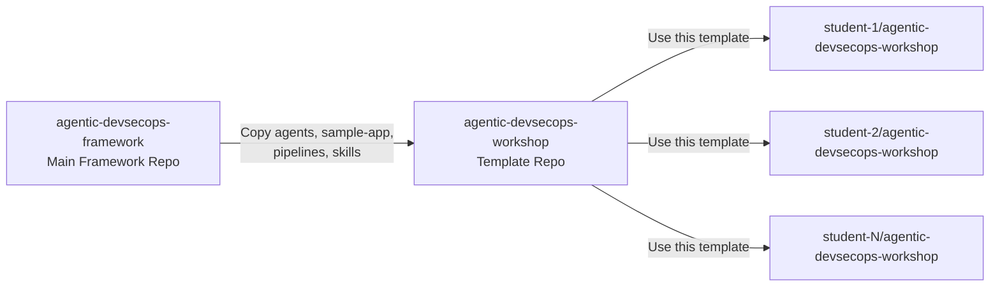
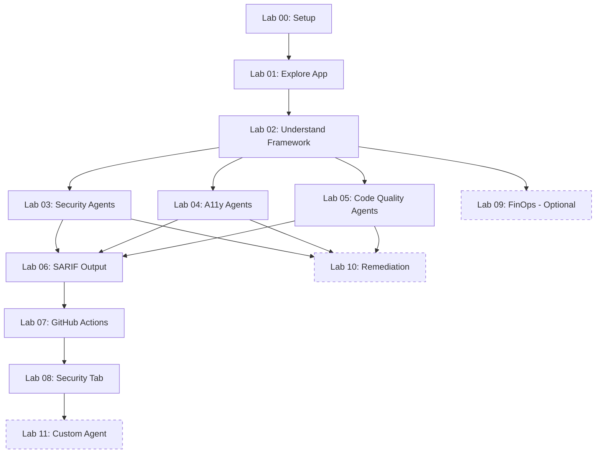

<!-- markdownlint-disable-file -->
# Task Research: Agentic DevSecOps Workshop — Zero to Hero Lab Design

Design a comprehensive hands-on workshop that teaches developers how to set up, install, deploy, and use the Agentic DevSecOps Framework from scratch. The workshop follows the pattern of [githubdevopsabcs/gh-abcs-developer](https://github.com/githubdevopsabcs/gh-abcs-developer) with step-by-step modules, time estimates, screenshot placeholders, and progressive difficulty — taking students from zero experience to confidently running AI-powered DevSecOps agents in VS Code against a sample app with intentional vulnerabilities, then visualizing results in GitHub Security tab.

## Task Implementation Requests

* Design a workshop repository structure modeled after gh-abcs-developer
* Determine whether 1 or 2 new repositories are needed
* Create 8–12 lab modules with time estimates, learning objectives, and verification checkpoints
* Include screenshot placeholders for each step
* Students run each agent manually in VS Code and visualize findings
* Students set up GitHub Actions pipelines and view results in GitHub Security tab
* Students use a personal GitHub account
* Progressive difficulty from beginner setup to advanced agent authoring

## Scope and Success Criteria

* Scope: Workshop content design, repository structure, module plan, screenshot strategy, student experience flow. Does NOT include writing the actual lab content (only the plan/outline). Covers GitHub Actions path; Azure DevOps path is noted as future work.
* Assumptions:
  * Students have a personal GitHub account with GitHub Copilot access (Individual, Business, or Enterprise)
  * Students have access to VS Code, Node.js v20+, and Git
  * Students do NOT have Azure subscriptions (FinOps labs are optional/advanced)
  * The workshop uses the GitHub template repository pattern for student onboarding
  * Workshop is designed for both instructor-led and self-paced delivery
* Success Criteria:
  * Clear repository strategy recommendation with rationale
  * 12 labs covering setup → agents → SARIF → CI/CD → GitHub Security → advanced
  * Time estimates totaling ~4.5 hours (core) or ~8.5 hours (extended)
  * Screenshot placeholders identified (46 total across all labs)
  * Student experience flow documented end-to-end

## Outline

1. Repository Strategy Analysis and Recommendation
2. Framework Inventory (agents, skills, instructions, prompts, pipelines)
3. Sample App Intentional Issues Inventory
4. Module/Lab Plan (12 labs with full metadata)
5. Screenshot Strategy and Directory Layout
6. Student Experience Flow (6 phases)
7. Workshop Repository Directory Structure
8. Lab File Template
9. Key Discoveries and Design Decisions
10. Considered Alternatives
11. Next Research and Implementation Steps

## Potential Next Research

* Detailed step-by-step command sequences and expected outputs per lab
  * Reasoning: Each lab needs exact commands students type and expected terminal/Copilot output
  * Reference: Subagent workshop-module-design-research.md — "Future Research for Implementation Phase"
* GitHub Codespaces devcontainer.json for zero-install workshops
  * Reasoning: Eliminates setup friction; students click one button and get a pre-configured environment
  * Reference: Industry best practice from GitHub Skills and MOAW patterns
* Instructor guide with talking points and time management
  * Reasoning: Instructor-led delivery needs pacing guidance beyond self-paced instructions
  * Reference: MOAW pattern — separate proctor/instructor files
* Assessment rubric (pass/fail criteria per lab)
  * Reasoning: Verification checkpoints need formalized criteria for grading
  * Reference: GitHub Skills automation pattern
* Azure DevOps parallel track
  * Reasoning: Framework includes 3 ADO pipeline samples; a parallel ADO lab track serves ADO-only teams
  * Reference: codebase-analysis-research.md — ADO pipeline findings

## Research Executed

### File Analysis

#### Agent Files (15 agents in `agents/`)

| Domain | Agent | File | Purpose | Invocation |
|--------|-------|------|---------|------------|
| Security | SecurityAgent | [agents/security-agent.agent.md](agents/security-agent.agent.md) | Orchestrator — delegates to 4 sub-agents | `@security-agent` |
| Security | SecurityReviewerAgent | [agents/security-reviewer-agent.agent.md](agents/security-reviewer-agent.agent.md) | OWASP Top 10 source code scanning | `@security-reviewer-agent` |
| Security | SecurityPlanCreator | [agents/security-plan-creator.agent.md](agents/security-plan-creator.agent.md) | Security plans from IaC blueprints | `@security-plan-creator` |
| Security | PipelineSecurityAgent | [agents/pipeline-security-agent.agent.md](agents/pipeline-security-agent.agent.md) | CI/CD pipeline hardening | `@pipeline-security-agent` |
| Security | IaCSecurityAgent | [agents/iac-security-agent.agent.md](agents/iac-security-agent.agent.md) | Terraform/Bicep/ARM misconfig detection | `@iac-security-agent` |
| Security | SupplyChainSecurityAgent | [agents/supply-chain-security-agent.agent.md](agents/supply-chain-security-agent.agent.md) | Dependencies, secrets, SBOM, licenses | `@supply-chain-security-agent` |
| Accessibility | A11yDetector | [agents/a11y-detector.agent.md](agents/a11y-detector.agent.md) | WCAG 2.2 Level AA violation detection | `@a11y-detector` |
| Accessibility | A11yResolver | [agents/a11y-resolver.agent.md](agents/a11y-resolver.agent.md) | Automated accessibility remediation | `@a11y-resolver` |
| Code Quality | CodeQualityDetector | [agents/code-quality-detector.agent.md](agents/code-quality-detector.agent.md) | Coverage, complexity, lint analysis | `@code-quality-detector` |
| Code Quality | TestGenerator | [agents/test-generator.agent.md](agents/test-generator.agent.md) | Automated test generation for coverage gaps | `@test-generator` |
| FinOps | CostAnalysisAgent | [agents/cost-analysis-agent.agent.md](agents/cost-analysis-agent.agent.md) | Azure cost query and reporting | `@cost-analysis-agent` |
| FinOps | CostAnomalyDetector | [agents/cost-anomaly-detector.agent.md](agents/cost-anomaly-detector.agent.md) | Cost spike detection and root cause | `@cost-anomaly-detector` |
| FinOps | CostOptimizerAgent | [agents/cost-optimizer-agent.agent.md](agents/cost-optimizer-agent.agent.md) | Right-sizing, reserved instances | `@cost-optimizer-agent` |
| FinOps | DeploymentCostGateAgent | [agents/deployment-cost-gate-agent.agent.md](agents/deployment-cost-gate-agent.agent.md) | IaC PR cost estimation and gating | `@deployment-cost-gate-agent` |
| FinOps | FinOpsGovernanceAgent | [agents/finops-governance-agent.agent.md](agents/finops-governance-agent.agent.md) | Tag compliance and governance | `@finops-governance-agent` |

* Source: [codebase-analysis-research.md](.copilot-tracking/research/subagents/2026-03-18/codebase-analysis-research.md), Section 1

#### Agent Design Patterns

* **Orchestrator Delegation**: SecurityAgent → 4 specialized sub-agents (SecurityReviewer, Pipeline, IaC, SupplyChain)
* **Detector/Resolver Handoff**: A11yDetector ↔ A11yResolver, CodeQualityDetector ↔ TestGenerator
* **SARIF Universal Format**: All 4 domains produce SARIF v2.1.0 with distinct `automationDetails.id` category prefixes
* Source: [docs/agent-patterns.md](docs/agent-patterns.md), [docs/architecture.md](docs/architecture.md)

#### Sample App Intentional Issues (40+ total)

| Domain | Count | Key Files |
|--------|-------|-----------|
| Security | 18+ | `src/lib/auth.ts` (7), `src/lib/db.ts` (4), `src/app/products/[id]/page.tsx` (2), `src/components/ProductCard.tsx` (1), `infra/main.bicep` (5 IaC) |
| Accessibility | 8+ | `src/app/layout.tsx` (1), `src/app/page.tsx` (3), `src/app/products/page.tsx` (1), `src/app/products/[id]/page.tsx` (1), `src/components/Header.tsx` (1) |
| Code Quality | 5+ | `src/lib/utils.ts` (4 issues), `__tests__/placeholder.test.ts` (1 — ~5% coverage) |
| FinOps / IaC | 11+ | `infra/main.bicep` (9), `infra/variables.bicep` (2) — ~$1,270/mo vs right-sized ~$30/mo |

* Source: [codebase-analysis-research.md](.copilot-tracking/research/subagents/2026-03-18/codebase-analysis-research.md), Section 2

#### GitHub Actions Workflows (7 in `.github/workflows/`)

| Workflow | Trigger | SARIF Upload | Category Prefix |
|----------|---------|--------------|-----------------|
| `security-scan.yml` | PR + push to `main` | Yes | `secret-scanning/`, `dependency-review/`, `codeql/`, `iac-scanning/`, `container-scanning/`, `dast/` |
| `accessibility-scan.yml` | PR + weekly cron | Yes | `accessibility-scan/` |
| `code-quality.yml` | PR | Yes | `code-quality/coverage/` |
| `finops-cost-gate.yml` | PR (IaC changes) | Yes | `finops-finding/v1` |
| `apm-security.yml` | PR (agent configs) | Yes | `agent-config-scan/` |
| `ci-full-test.yml` | PR + push to `main` | No | — (validation only) |
| `deploy-to-github-private.yml` | Push to `main` | No | — (sync only) |

* Source: [codebase-analysis-research.md](.copilot-tracking/research/subagents/2026-03-18/codebase-analysis-research.md), Section 3

### Code Search Results

* `INTENTIONAL-VULNERABILITY` markers — not confirmed present in source code (sample-app README documents the issues but markers may not be in code comments; needs verification during implementation)
* `dangerouslySetInnerHTML` — found in `ProductCard.tsx`, `products/[id]/page.tsx` (intentional XSS vectors)
* `Math.random()` — found in `auth.ts` (intentional weak token generation)
* `md5` — found in `auth.ts` (intentional weak hashing)
* Raw SQL strings — found in `db.ts` (intentional SQL injection)

### External Research

* **gh-abcs-developer repository**: Analyzed via GitHub API
  * 6 labs + setup.md in flat `labs/` folder
  * Template repository pattern — students use "Use this template"
  * Checklist README with `- [ ]` progress tracking
  * No screenshots, no images — entirely text-based
  * Progressive difficulty: Labs 1–3 beginner (5–10 min), Labs 4–6 intermediate (15–20 min)
  * Source: [reference-workshop-research.md](.copilot-tracking/research/subagents/2026-03-18/reference-workshop-research.md)

* **Microsoft MOAW (Mother Of All Workshops)**: `microsoft/moaw` pattern
  * YAML front matter metadata (level, duration, tags)
  * Assets folder convention
  * Admonition-style callouts (info, warning, tip, task)
  * Source: [reference-workshop-research.md](.copilot-tracking/research/subagents/2026-03-18/reference-workshop-research.md)

* **GitHub Skills**: `skills/introduction-to-github` pattern
  * Template repository with Actions-driven lesson progression
  * "Who is this for" audience tags
  * Learning objectives and duration estimates
  * Source: [reference-workshop-research.md](.copilot-tracking/research/subagents/2026-03-18/reference-workshop-research.md)

### Project Conventions

* Standards referenced: SARIF v2.1.0, OWASP Top 10, WCAG 2.2 Level AA, CIS Azure Benchmarks
* Instructions followed: `.github/copilot-instructions.md` (SARIF output standard, severity classification, agent output format)
* ADO workflow: `.github/instructions/ado-workflow.instructions.md` (branching, commit messages, PR workflow)

---

## Key Discoveries

### Project Structure

The framework repository (`agentic-devsecops-framework`) contains everything needed for the workshop in a self-contained structure:

```text
agentic-devsecops-framework/
├── agents/              # 15 agent definitions (.agent.md)
├── instructions/        # 3 always-on instruction files
├── prompts/             # 2 reusable prompt templates
├── skills/              # 2 domain knowledge packages
├── sample-app/          # Next.js 14 app with 40+ intentional issues
│   ├── src/             # Application source code
│   ├── infra/           # Bicep IaC with misconfigurations
│   └── __tests__/       # Placeholder test (~5% coverage)
├── .github/workflows/   # 7 GitHub Actions pipelines
├── samples/azure-devops/ # 3 ADO pipeline samples
├── docs/                # 9 architecture and pattern docs
└── scripts/             # Validation and reporting tools
```

### Implementation Patterns

#### Agent Invocation (How Students Run Agents)

Students invoke agents in VS Code Copilot Chat using three patterns:

1. **Direct invocation**: `@agent-name <instruction>` in Copilot Chat
2. **Prompt file**: `/prompt-name arg1=value1` for templated scans
3. **Handoff**: Agent A completes scan → offers button/link → Agent B applies fixes

Example security scan:
```
@security-reviewer-agent Scan sample-app/src/ for OWASP Top 10 vulnerabilities. Report findings with CWE IDs and severity.
```

Example accessibility scan via prompt file:
```
/a11y-scan component=sample-app/src/app/page.tsx
```

#### SARIF Category Registry

| Category Prefix | Domain | Appears In |
|-----------------|--------|------------|
| `security/` | Security | Security tab → Code Scanning |
| `accessibility-scan/` | Accessibility | Security tab → Code Scanning |
| `code-quality/coverage/` | Code Quality | Security tab → Code Scanning |
| `finops-finding/v1` | FinOps | Security tab → Code Scanning |
| `agent-config-scan/` | Prompt Security | Security tab → Code Scanning |

### Complete Examples

#### Workshop README (Main Entry Point)

```markdown
# Agentic DevSecOps Workshop

> Learn to use AI-powered DevSecOps agents in VS Code — from zero to hero.

## Workshop Modules

### Setup
- [ ] [Lab 00 - Prerequisites and Environment Setup](labs/lab-00-setup.md) _(30 min, Beginner)_

### Part 1: Foundations
- [ ] [Lab 01 - Explore the Sample App](labs/lab-01.md) _(25 min, Beginner)_
- [ ] [Lab 02 - Understanding Agents, Skills, and Instructions](labs/lab-02.md) _(20 min, Beginner)_

### Part 2: Hands-On Agent Scanning
- [ ] [Lab 03 - Security Scanning with Copilot Agents](labs/lab-03.md) _(40 min, Intermediate)_
- [ ] [Lab 04 - Accessibility Scanning with Copilot Agents](labs/lab-04.md) _(35 min, Intermediate)_
- [ ] [Lab 05 - Code Quality Analysis with Copilot Agents](labs/lab-05.md) _(35 min, Intermediate)_

### Part 3: SARIF and CI/CD Integration
- [ ] [Lab 06 - Understanding SARIF Output](labs/lab-06.md) _(30 min, Intermediate)_
- [ ] [Lab 07 - Setting Up GitHub Actions Pipelines](labs/lab-07.md) _(40 min, Intermediate)_
- [ ] [Lab 08 - Viewing Results in GitHub Security Tab](labs/lab-08.md) _(25 min, Intermediate)_

### Part 4: Advanced Topics (Optional)
- [ ] [Lab 09 - FinOps Agents and Azure Cost Governance](labs/lab-09.md) _(45 min, Advanced)_
- [ ] [Lab 10 - Agent Remediation Workflows](labs/lab-10.md) _(45 min, Advanced)_
- [ ] [Lab 11 - Creating Your Own Custom Agent](labs/lab-11.md) _(45 min, Advanced)_
```

#### Lab File Template

```markdown
# Lab NN - Lab Title

> **Duration**: X–Y minutes | **Level**: Beginner/Intermediate/Advanced

## Overview

One-paragraph description of what the student will accomplish.

## Learning Objectives

By the end of this lab, you will be able to:

- Objective 1
- Objective 2
- Objective 3

## Prerequisites

- Complete [Lab NN-1](lab-NN-1.md)
- Additional requirement

## References

- [Reference 1](URL)
- [Reference 2](URL)

## Exercises

### Exercise N.1: Title

1. Step-by-step instruction
2. Next step

   <!-- TODO: Capture screenshot lab-NN-step-description.png -->
   

3. **Verify**: You should see [expected result]

### Exercise N.2: Title

1. Next exercise steps...

## Summary

In this lab, you:

- Accomplished X
- Learned Y
- Practiced Z

## Next Steps

Continue to [Lab NN+1 - Next Title](lab-NN+1.md).
```

### API and Schema Documentation

#### SARIF v2.1.0 Required Fields (from docs/sarif-integration.md)

* `$schema`: `https://raw.githubusercontent.com/oasis-tcs/sarif-spec/main/sarif-2.1/schema/sarif-schema-2.1.0.json`
* `version`: `2.1.0`
* `runs[].tool.driver.name`: Agent name (e.g., `SecurityReviewerAgent`)
* `runs[].tool.driver.rules[]`: Unique `ruleId` per finding type
* `runs[].results[].level`: `error` / `warning` / `note`
* `runs[].results[].locations[]`: File path and line numbers
* `automationDetails.id`: Category prefix (e.g., `security/`)
* `partialFingerprints`: For deduplication across runs

### Configuration Examples

#### Workshop devcontainer.json (Future Enhancement)

```json
{
  "name": "Agentic DevSecOps Workshop",
  "image": "mcr.microsoft.com/devcontainers/javascript-node:20",
  "features": {
    "ghcr.io/devcontainers/features/github-cli:1": {}
  },
  "customizations": {
    "vscode": {
      "extensions": [
        "github.copilot",
        "github.copilot-chat",
        "MS-SarifVSCode.sarif-viewer",
        "dbaeumer.vscode-eslint"
      ]
    }
  },
  "postCreateCommand": "cd sample-app && npm install"
}
```

---

## Technical Scenarios

### Scenario 1: Repository Strategy

How many new repositories should be created, and what structure should they use?

**Requirements:**

* Students create from a GitHub template with one click
* All workshop content (labs, sample app, agents, pipelines) is self-contained
* GitHub Actions SARIF uploads appear in the student's own Security tab
* Agent definitions are discoverable by VS Code Copilot Chat
* Minimize student confusion and cross-repo coordination
* The main framework repo (`agentic-devsecops-framework`) remains unchanged

**Preferred Approach: Option A — One New Workshop Repository**

Create **one** new repository: `agentic-devsecops-workshop`

Marked as a GitHub **Template Repository** so students click "Use this template" → "Create a new repository" and get their own copy with full GitHub Actions support.

```text
agentic-devsecops-workshop/          ← NEW REPO (Template)
├── README.md                        # Workshop overview + module checklist
├── labs/
│   ├── lab-00-setup.md              # Prerequisites and setup
│   ├── lab-01.md through lab-11.md  # 12 lab modules
├── images/
│   ├── banner.png                   # Workshop banner
│   ├── lab-00/ through lab-11/      # Screenshots per lab
├── sample-app/                      # Copy of sample Next.js app
│   ├── src/
│   ├── infra/
│   ├── package.json
│   └── ...
├── agents/                          # Copy of 15 agent definitions
├── instructions/                    # Copy of 3 instruction files
├── prompts/                         # Copy of 2 prompt templates
├── skills/                          # Copy of 2 skill packages
├── .github/
│   └── workflows/                   # Workshop-appropriate pipelines
├── solutions/                       # (Optional) completed lab solutions
├── _config.yml                      # Jekyll theme for GitHub Pages
├── CODE_OF_CONDUCT.md
├── CONTRIBUTING.md
└── LICENSE
```

**Rationale:**

1. **Simplest student experience**: One clone, one repo, one Security tab. No cross-repo coordination.
2. **Self-contained**: Everything students need — labs, sample app, agents, pipelines — lives in one place.
3. **GitHub Security tab works immediately**: SARIF uploads from workflows appear in the same repo where students view results.
4. **Template-ready**: Students click "Use this template" and get a fully functional copy with Actions support.
5. **Agent configs work at repo level**: Agents in `agents/` are discovered by VS Code for that repo workspace.
6. **Matches proven pattern**: gh-abcs-developer, GitHub Skills, and MOAW all use single-repo patterns.

**Answer to the user's question**: You need to create **1 new repository** (`agentic-devsecops-workshop`). A separate sample app repo is NOT needed because the sample app is included as a subfolder. The main framework repo remains unchanged.



**Implementation Details:**

1. Create the repo under `devopsabcs-engineering` org (or a dedicated workshop org)
2. Mark as Template Repository in Settings → General
3. Copy from framework: `agents/`, `instructions/`, `prompts/`, `skills/`, `sample-app/`
4. Copy and adapt workflows: select the 3–4 most relevant workflows (security-scan, accessibility-scan, code-quality, finops-cost-gate); remove org-specific ones (deploy-to-github-private)
5. Create `labs/` folder with all lab files
6. Create `images/` folder structure for screenshots
7. Enable GitHub Pages with Jekyll theme for a polished web view

#### Considered Alternatives

**Option B: Two Repos (Workshop + Template App)**

* Workshop docs in one repo, sample app + agents as a separate template repo
* **Rejected because**: Adds complexity — students must manage two repos, Security tab findings are in a different repo than the instructions, and cross-repo links break when students create their own copies.

**Option C: Fork the Main Framework Repo**

* Students fork `agentic-devsecops-framework` directly
* **Rejected because**: Framework repo is designed for org-wide deployment, not learning. It includes validation scripts, exec summary generators, ADO MCP config, and other operational tooling that would confuse students. GitHub Actions may not run on forks without explicit configuration. Students cannot push to branches without fork PR workflows.

---

### Scenario 2: Workshop Module Plan

Design the lab progression from zero to hero.

**Requirements:**

* 8–12 labs covering all four domains (Security, Accessibility, Code Quality, FinOps)
* Progressive difficulty: Beginner → Intermediate → Advanced
* Time estimates per lab
* Core track completable in half a day (~4–5 hours)
* Advanced track optional
* Each lab has learning objectives, prerequisites, verification checkpoints

**Preferred Approach: 12-Lab Progressive Plan**

| Lab | Title | Minutes | Level | Prerequisites |
|-----|-------|---------|-------|---------------|
| 00 | Prerequisites and Environment Setup | 30 | Beginner | None |
| 01 | Explore the Sample App | 25 | Beginner | Lab 00 |
| 02 | Understanding Agents, Skills, and Instructions | 20 | Beginner | Lab 01 |
| 03 | Security Scanning with Copilot Agents | 40 | Intermediate | Labs 00–02 |
| 04 | Accessibility Scanning with Copilot Agents | 35 | Intermediate | Labs 00–02 |
| 05 | Code Quality Analysis with Copilot Agents | 35 | Intermediate | Labs 00–02 |
| 06 | Understanding SARIF Output | 30 | Intermediate | Labs 03–05 (≥1) |
| 07 | Setting Up GitHub Actions Pipelines | 40 | Intermediate | Labs 00–06 |
| 08 | Viewing Results in GitHub Security Tab | 25 | Intermediate | Lab 07 |
| 09 | FinOps Agents and Azure Cost Governance | 45 | Advanced | Labs 00–02 + Azure |
| 10 | Agent Remediation Workflows | 45 | Advanced | Labs 03–05 |
| 11 | Creating Your Own Custom Agent | 45 | Advanced | Labs 00–08 |

**Delivery Tiers:**

| Tier | Labs | Duration | Use Case |
|------|------|----------|----------|
| Half-Day | 00–08 | ~4 hr 40 min | Conference workshop, team onboarding |
| Full-Day | 00–10 | ~6 hr 10 min | Training day with lunch break |
| Extended | 00–11 | ~6 hr 55 min | Multi-day or self-paced online course |

**Lab Details:**

**Lab 00 — Prerequisites and Environment Setup (30 min, Beginner)**
* Install VS Code, Node.js v20+, Git
* Install extensions: GitHub Copilot, Copilot Chat, SARIF Viewer, ESLint
* Verify Copilot Chat responds
* Create repo from template ("Use this template")
* Verification: Extensions active, Node.js v20+, Copilot Chat functional

**Lab 01 — Explore the Sample App (25 min, Beginner)**
* Clone repo locally, open in VS Code
* Explore folder structure: agents/, instructions/, prompts/, skills/, sample-app/
* Read sample-app/README.md — intentional issues table
* Install dependencies: `cd sample-app && npm install`
* Run app: `npm run dev`, open http://localhost:3000
* Browse the app — products page, product detail
* Verification: App running locally, can identify 3+ intentional issues

**Lab 02 — Understanding Agents, Skills, and Instructions (20 min, Beginner)**
* Open a security agent file — examine YAML frontmatter and body
* Open an accessibility agent — note the handoff to resolver
* Open a skill file — understand domain knowledge packages
* Open an instruction file — understand always-on rules
* Open a prompt file — understand reusable templates
* Map the ecosystem: Agents → Skills → Instructions → Prompts
* Verification: Can explain the difference between all four artifact types

**Lab 03 — Security Scanning with Copilot Agents (40 min, Intermediate)**
* Invoke `@security-reviewer-agent` on `sample-app/src/`
* Review findings: SQL injection, XSS, hardcoded secrets, weak crypto
* Invoke `@iac-security-agent` on `sample-app/infra/main.bicep`
* Review IaC findings: public access, TLS 1.0, overly permissive firewall
* Invoke `@supply-chain-security-agent` on `sample-app/package.json`
* Compare all findings against README intentional issues table
* Verification: Agent found ≥5 security vulnerabilities with CWE IDs

**Lab 04 — Accessibility Scanning with Copilot Agents (35 min, Intermediate)**
* Invoke `@a11y-detector` on `sample-app/src/`
* Review WCAG violations: missing lang, low contrast, missing labels, small targets
* Try handoff to `@a11y-resolver` for automated fixes
* Use `/a11y-scan` prompt file for targeted component scan
* Compare findings against README accessibility issues table
* Verification: Detector found ≥5 WCAG violations, Resolver proposed ≥2 fixes

**Lab 05 — Code Quality Analysis with Copilot Agents (35 min, Intermediate)**
* Run `npm test -- --coverage` — observe ~5% coverage
* Invoke `@code-quality-detector` on `sample-app/`
* Review findings: low coverage, high complexity, `any` types, duplication
* Try handoff to `@test-generator` for uncovered functions in `utils.ts`
* (Optional) Apply generated tests and re-run coverage
* Verification: CodeQualityDetector identified low coverage, TestGenerator produced tests

**Lab 06 — Understanding SARIF Output (30 min, Intermediate)**
* Open `validation-results.sarif` in editor — examine JSON structure
* Open with SARIF Viewer extension — navigate findings
* Learn SARIF fields: tool, rules, results, level, locations
* Understand category prefixes: security/, accessibility-scan/, code-quality/coverage/
* Understand severity mapping: error=CRITICAL/HIGH, warning=MEDIUM, note=LOW
* Verification: Can identify key SARIF fields, navigate findings in SARIF Viewer

**Lab 07 — Setting Up GitHub Actions Pipelines (40 min, Intermediate)**
* Review 4 workshop-relevant workflow files in `.github/workflows/`
* Ensure GitHub Actions enabled in repo settings
* Create branch: `git checkout -b feature/test-pipeline`
* Make a small change to `sample-app/src/app/page.tsx`
* Commit, push, open PR against `main`
* Watch workflows run in Actions tab
* Verification: ≥2 workflows triggered, can see workflow logs

**Lab 08 — Viewing Results in GitHub Security Tab (25 min, Intermediate)**
* Navigate to repo → Security tab
* Explore Code Scanning alerts — filter by tool, severity, category
* Click a finding — view detail with code location
* Explore Dependabot alerts (if SCA ran)
* (Exercise) Dismiss a finding, create an Issue from another
* Verification: Can navigate Security tab, filter findings, view details

**Lab 09 — FinOps Agents and Azure Cost Governance (45 min, Advanced, Optional)**
* Requires Azure subscription with Cost Management Reader role
* Invoke `@cost-analysis-agent` on `sample-app/infra/main.bicep`
* See oversized SKUs: P1v3 ($420/mo) vs B1 ($13/mo), GP_Gen5_8 ($800/mo) vs Basic ($5/mo)
* Invoke `@finops-governance-agent` — find missing governance tags
* Invoke `@deployment-cost-gate-agent` — estimate exceeds $100 budget
* (Exercise) Right-size variables.bicep and re-run cost analysis
* Verification: Cost analysis found ≥3 optimization opportunities

**Lab 10 — Agent Remediation Workflows (45 min, Advanced)**
* Security remediation cycle: Scan → Fix MD5 → Re-scan
* Accessibility remediation cycle: Detect → Fix lang attribute → Re-scan
* Code quality cycle: Detect → Generate tests → Re-run coverage
* Commit all fixes with proper commit message
* Verification: Completed ≥1 full Detect → Fix → Verify cycle

**Lab 11 — Creating Your Own Custom Agent (45 min, Advanced)**
* Choose a domain (performance, licensing, documentation quality)
* Create `agents/my-custom-agent.agent.md` with YAML frontmatter
* Write agent persona, scope, detection protocol, output format
* Test in Copilot Chat: `@my-custom-agent Analyze the sample-app...`
* Iterate on prompt quality
* (Exercise) Create a companion skill file
* Verification: Custom agent responds with structured output

**Implementation Details:**

Labs 03, 04, and 05 are independent of each other and can be done in any order after Lab 02. This allows flexibility in instructor-led delivery (e.g., focus on just Security + CI/CD for a security audience).



#### Considered Alternatives

**8-Lab Minimal Plan**: Merge Labs 03–05 into one "Agent Scanning" lab, skip SARIF deep dive, skip advanced labs. Rejected because: Cramming three agent domains into one lab (90+ min) creates cognitive overload and doesn't let students appreciate each domain's unique value.

**16-Lab Granular Plan**: Split each agent domain into scan + remediation labs. Rejected because: Too many small labs increase overhead (each lab has setup/summary cost) and the workshop becomes unwieldy for half-day delivery.

---

### Scenario 3: Screenshot Strategy

**Requirements:**

* Placeholders in lab files until author captures real screenshots
* Organized by lab in dedicated folders
* Consistent naming convention
* 46 total screenshots across 12 labs

**Preferred Approach:**

```text
images/
├── banner.png                          # Workshop banner (1280×640)
├── lab-00/
│   ├── lab-00-vscode-extensions.png
│   ├── lab-00-copilot-chat-verify.png
│   └── lab-00-node-version.png
├── lab-01/
│   ├── lab-01-template-create.png
│   ├── lab-01-folder-structure.png
│   ├── lab-01-issue-markers.png
│   └── lab-01-app-running.png
├── ...                                 # (lab-02 through lab-11)
```

**Naming Convention**: `lab-{NN}-{descriptive-slug}.png` — lowercase, hyphens, two-digit lab number.

**Placeholder in Markdown**:
```markdown
<!-- TODO: Capture screenshot lab-00-vscode-extensions.png -->

```

**Total Screenshot Inventory:**

| Lab | Screenshots | Key Captures |
|-----|-------------|--------------|
| 00 | 3 | Extensions panel, Copilot Chat verify, Node version |
| 01 | 4 | Template create dialog, folder structure, issue markers, app running |
| 02 | 3 | Agent file frontmatter, domain diagram, handoff pattern |
| 03 | 4 | Security agent invocation, findings output, IaC scan, comparison |
| 04 | 4 | A11y agent invocation, WCAG findings, handoff to resolver, prompt file |
| 05 | 4 | Coverage output, quality findings, test generator, coverage improved |
| 06 | 4 | SARIF raw JSON, SARIF Viewer, navigate to source, category diagram |
| 07 | 4 | Workflow files, PR created, Actions running, Actions complete |
| 08 | 5 | Security tab, code scanning, finding detail, Dependabot, overview |
| 09 | 4 | Cost analysis, tag governance, cost gate, workflow file |
| 10 | 4 | Security fix, a11y fix, test generation, coverage before/after |
| 11 | 3 | Custom agent file, agent invocation, agent output |
| **Total** | **46** | |

---

## Considered Alternatives (Repository Strategy)

### Option B: Two Repos (Workshop + Template App)

* `agentic-devsecops-workshop` — lab docs, images, solutions
* `agentic-devsecops-sample-app` — sample app + agents + workflows (template)

**Evidence Against:**
* Adds friction: students manage two repos, clone two repos, reference two URLs
* Security tab findings appear in the app repo, but instructions are in the workshop repo — disconnect
* Cross-repo markdown links break when students create their copies
* Two repos to keep synchronized with the main framework

### Option C: Fork Main Framework Repo

* Students fork `agentic-devsecops-framework` directly

**Evidence Against:**
* Framework repo includes operational tooling (exec summary generator, ADO MCP config, deploy-to-github-private workflow) that confuses students
* GitHub Actions don't run on forks by default without explicit `workflow_dispatch` configuration
* Framework repo structure is optimized for production deployment, not learning
* Students can't easily push branches without PR-to-upstream workflows

---

## Next Steps for Implementation

1. **Create the workshop repository** (`agentic-devsecops-workshop`) under `devopsabcs-engineering` org
2. **Copy framework assets**: agents/, instructions/, prompts/, skills/, sample-app/ from the framework repo
3. **Adapt workflows**: Copy security-scan, accessibility-scan, code-quality, finops-cost-gate; remove deploy-to-github-private and apm-security
4. **Write Lab 00 (Setup)** first — this is the gateway lab for all students
5. **Write Labs 01–02 (Foundations)** — orientation and exploration
6. **Write Labs 03–05 (Agent Scanning)** — the core hands-on experience
7. **Write Labs 06–08 (SARIF + CI/CD)** — connecting IDE agents to pipelines and Security tab
8. **Write Labs 09–11 (Advanced)** — optional advanced topics
9. **Create images/ folder structure** with placeholder images
10. **Mark repo as Template Repository** in GitHub settings
11. **Test the full student journey** end-to-end (author walks through as a student)
12. **Capture real screenshots** during the test walkthrough
13. **Enable GitHub Pages** with Jekyll theme for rendered workshop site
14. **(Optional) Add devcontainer.json** for Codespaces zero-install experience

---

## Subagent Research Documents

| Document | Path | Topics Covered |
|----------|------|----------------|
| Codebase Analysis | [.copilot-tracking/research/subagents/2026-03-18/codebase-analysis-research.md](.copilot-tracking/research/subagents/2026-03-18/codebase-analysis-research.md) | 15 agents, sample app vulnerabilities, 7 workflows, skills, instructions, prompts |
| Reference Workshop | [.copilot-tracking/research/subagents/2026-03-18/reference-workshop-research.md](.copilot-tracking/research/subagents/2026-03-18/reference-workshop-research.md) | gh-abcs-developer structure, MOAW patterns, GitHub Skills patterns, lab templates |
| Workshop Module Design | [.copilot-tracking/research/subagents/2026-03-18/workshop-module-design-research.md](.copilot-tracking/research/subagents/2026-03-18/workshop-module-design-research.md) | Repo strategy, 12-lab plan, screenshot inventory, student flow |
