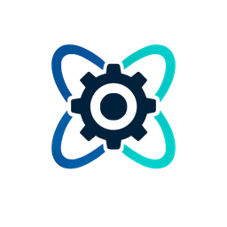
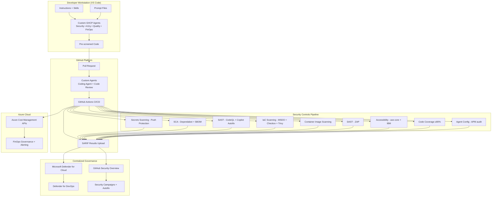

<p align="center">
  
</p>

<h1 align="center">Agentic Accelerator Framework</h1>

<p align="center">
  <strong>GitHub Advanced Security + GitHub Copilot Custom Agents + Microsoft Defender for Cloud</strong><br>
  <em>Shift-left security and compliance across Security, Accessibility, Code Quality, FinOps, and APM Security</em>
</p>

<p align="center">
  <a href="#agent-inventory-17-agents"></a>
  <a href="#ci-cd-workflows"></a>
  <a href="https://github.com/devopsabcs-engineering/agentic-accelerator-framework/actions"></a>
  <a href="LICENSE"></a>
</p>

---

## Overview

The Agentic Accelerator Framework provides a repeatable, org-wide approach to shifting security and compliance left using custom GitHub Copilot agents. It covers five domains — Security, Accessibility, Code Quality, FinOps, and APM Security — with SARIF-based CI/CD integration across GitHub Actions and Azure DevOps.

The framework operates on a "shift-left then scale" principle:

1. **Shift Left**: Custom GHCP agents run in VS Code (IDE) before commit and in GitHub platform during PR review.
2. **Automate**: CI/CD pipelines (GitHub Actions + Azure DevOps Pipelines) run the same controls as automated gates.
3. **Report**: All findings output SARIF v2.1.0 for unified consumption (GitHub Code Scanning + ADO Advanced Security).
4. **Govern**: Security Overview + Defender for Cloud + Defender for DevOps + Power BI dashboards provide centralized governance.

## Architecture



## Agent Inventory (17 Agents)

| Domain         | Agents                                                                                                         | SARIF Category         | Description                                           |
|----------------|----------------------------------------------------------------------------------------------------------------|------------------------|-------------------------------------------------------|
| **Security**   | SecurityAgent, SecurityReviewerAgent, SecurityPlanCreator, PipelineSecurityAgent, IaCSecurityAgent, SupplyChainSecurityAgent (6) | `security/`            | Application and infrastructure security scanning      |
| **Accessibility** | A11yDetector, A11yResolver (2)                                                                              | `accessibility-scan/`  | WCAG 2.2 Level AA compliance detection and remediation |
| **Code Quality** | CodeQualityDetector, TestGenerator (2)                                                                       | `code-quality/coverage/` | Code coverage, linting, and test generation          |
| **FinOps**     | CostAnalysisAgent, FinOpsGovernanceAgent, CostAnomalyDetector, CostOptimizerAgent, DeploymentCostGateAgent (5) | `finops-finding/v1`    | Azure cost optimization and governance                |
| **APM Security** | APMSecurityDetector, APMSecurityResolver (2)                                                                 | `apm-security/`        | Agent configuration file security scanning            |

## Repository Structure

This repository uses the `.github-private` org-wide layout where agent configuration directories are at the repo root:

```text
agents/                  ← 15 custom GHCP agent definitions (.agent.md)
instructions/            ← Path-specific instruction files (a11y-remediation, code-quality, wcag22-rules)
prompts/                 ← Reusable prompt templates (a11y-fix, a11y-scan)
skills/                  ← On-demand domain knowledge (a11y-scan, security-scan)
scripts/                 ← Agent validation tooling (validate-agents.mjs)
apm.yml                  ← APM dependency manifest
mcp.json                 ← MCP server configuration (ADO work items)
.github/
  CODEOWNERS             ← Mandatory security-team review for agent config paths
  copilot-instructions.md ← Repo-wide Copilot conventions
  instructions/          ← Workflow instructions (ado-workflow)
  skills/                ← Additional skills (docx, pdf, pptx, xlsx, Power BI)
  workflows/             ← 7 GitHub Actions CI/CD pipelines
docs/                    ← Framework documentation (9 guides)
sample-app/              ← Next.js demo application with Bicep infrastructure
samples/
  azure-devops/          ← 3 sample ADO pipeline YAML files
```

## CI/CD Workflows

| Workflow                        | Trigger                        | Purpose                                                     |
|---------------------------------|--------------------------------|-------------------------------------------------------------|
| `security-scan.yml`             | PR and push to `main`          | SCA, SAST (CodeQL), IaC, container, and DAST scanning       |
| `accessibility-scan.yml`        | PR and weekly schedule          | Three-engine a11y scan with threshold gating                |
| `code-quality.yml`              | PR                             | Lint, type check, test, and 80% coverage gate               |
| `finops-cost-gate.yml`          | PR (IaC file changes)          | Infracost estimate against monthly budget                   |
| `apm-security.yml`              | PR (agent config file changes) | APM audit for prompt file supply chain attacks              |
| `ci-full-test.yml`              | Push and PR to `main`          | Agent validation (structure, cross-refs, domain rules)      |
| `deploy-to-github-private.yml`  | Push to `main`                 | Syncs agent config to org-wide `.github-private` repository |

## Quick Start

1. Clone this repository (or use as `.github-private` for org-wide deployment).
2. Review the 15 agent definitions in `agents/`.
3. Customize `instructions/` and `prompts/` for your organization's standards.
4. Enable GitHub Actions workflows for CI/CD integration.
5. Configure `mcp.json` with your Azure DevOps organization details.
6. Run `apm audit` to validate agent configuration file integrity.

## Documentation

* [Architecture](docs/architecture.md) — Framework architecture and design patterns
* [Agent Patterns](docs/agent-patterns.md) — Agent file specification and YAML frontmatter schema
* [Agent Extensibility](docs/agent-extensibility.md) — Plugin architecture, MCP integration, and APM dependency management
* [SARIF Integration](docs/sarif-integration.md) — SARIF v2.1.0 mapping for all domains
* [Platform Comparison](docs/platform-comparison.md) — GitHub vs Azure DevOps feature comparison
* [Azure DevOps Pipelines](docs/azure-devops-pipelines.md) — ADO YAML pipeline equivalents for each workflow
* [Centralized Governance](docs/centralized-governance.md) — Dual-platform dashboards and Defender for Cloud integration
* [Prompt File Security](docs/prompt-file-security.md) — Threat model and APM defense for agent configuration files
* [Implementation Roadmap](docs/implementation-roadmap.md) — Phased rollout plan
* [Domain Parity and Contribution Guide](docs/domain-parity-and-contribution.md) — Cross-domain feature parity comparison and guide for contributing new domains

## Standards

* **SARIF v2.1.0**: OASIS SARIF specification for unified findings output
* **WCAG 2.2 Level AA**: W3C accessibility standard
* **OWASP Top 10**: Application security risks
* **OWASP LLM Top 10**: AI/LLM security risks
* **CIS Azure Benchmarks, NIST 800-53, PCI-DSS**: Compliance frameworks

## Workshops

* [Agentic Accelerator Workshop](https://devopsabcs-engineering.github.io/agentic-accelerator-workshop/) — Hands-on workshop for building and deploying custom GitHub Copilot agents with the Agentic Accelerator Framework
* [Accessibility Scan Workshop](https://devopsabcs-engineering.github.io/accessibility-scan-workshop/) — Workshop for WCAG 2.2 Level AA accessibility scanning and remediation using custom agents
* [Code Quality Scan Workshop](https://devopsabcs-engineering.github.io/code-quality-scan-workshop/) — Workshop for code quality scanning with ESLint, Ruff, jscpd, Lizard, and coverage tools
* [FinOps Scan Workshop](https://devopsabcs-engineering.github.io/finops-scan-workshop/) — Workshop for Azure cost optimization and FinOps governance using custom agents
* [APM Security Scan Workshop](https://devopsabcs-engineering.github.io/apm-security-scan-workshop/) — Workshop for agent configuration file security scanning with Unicode, semantic, and MCP validation engines

## Domain Repositories

Each domain has a scanner platform repo (demo-app) and a workshop template repo:

| Domain | Scanner Platform | Workshop |
|--------|-----------------|----------|
| **Accessibility** | [accessibility-scan-demo-app](https://github.com/devopsabcs-engineering/accessibility-scan-demo-app) | [accessibility-scan-workshop](https://github.com/devopsabcs-engineering/accessibility-scan-workshop) |
| **Code Quality** | [code-quality-scan-demo-app](https://github.com/devopsabcs-engineering/code-quality-scan-demo-app) | [code-quality-scan-workshop](https://github.com/devopsabcs-engineering/code-quality-scan-workshop) |
| **FinOps** | [finops-scan-demo-app](https://github.com/devopsabcs-engineering/finops-scan-demo-app) | [finops-scan-workshop](https://github.com/devopsabcs-engineering/finops-scan-workshop) |
| **APM Security** | [apm-security-scan-demo-app](https://github.com/devopsabcs-engineering/apm-security-scan-demo-app) | [apm-security-scan-workshop](https://github.com/devopsabcs-engineering/apm-security-scan-workshop) |

## DIY: Build a New Domain

Ready to build the Code Quality domain from scratch? The framework includes a `DomainScaffolder` agent and complete automation artifacts for generating scanner demo-app and workshop repositories with full parity to the existing Accessibility, Code Quality, and FinOps domains.

See the **[DIY: Build the APM Security Domain](docs/DIY-APM-Security-Domain.md)** guide for step-by-step instructions covering repo creation, sample app development, SARIF converters, workshop labs, Power BI PBIP, and ADO pipeline setup.

## License

This project is licensed under the [MIT License](LICENSE).
