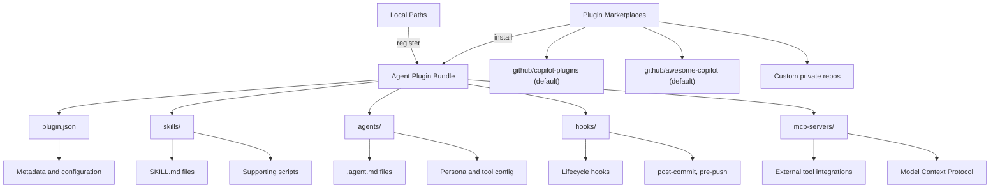

## Overview

GitHub Copilot custom agents support multiple extensibility mechanisms, from lightweight instruction files to full plugin bundles with marketplace distribution. This document describes the plugin architecture, comparison of extensibility approaches, organization-scale sharing patterns, MCP server integration, and APM dependency management.

## Agent Plugin Architecture

Agent plugins are prepackaged bundles of chat customizations installable from Git-based marketplaces in VS Code. A single plugin can provide any combination of skills, agents, hooks, slash commands, and MCP server configurations.



### Plugin Directory Structure

A typical plugin bundles agents, skills, and hooks into a single installable unit:

```text
my-accelerator-plugin/
  plugin.json              # Plugin metadata
  skills/
    security-scan/SKILL.md # Security scanning skill
    a11y-scan/SKILL.md     # Accessibility scanning skill
  agents/
    security-agent.md      # Security review agent
    a11y-detector.agent.md # A11y detection agent
  hooks/
    post-commit.json       # Post-commit security check
```

The `plugin.json` file declares the plugin name, version, description, and lists the capabilities included in the bundle.

### Plugin Marketplaces

VS Code discovers plugins from three sources:

- **Default marketplaces**: `github/copilot-plugins` and `github/awesome-copilot` are searched automatically.
- **Custom marketplaces**: Configure additional sources via the `chat.plugins.marketplaces` setting. Supported formats include `owner/repo` shorthand, HTTPS `.git` URLs, SCP-style git remotes, and `file:///` URIs. Private repositories are supported.
- **Local plugins**: Register local directories via `chat.plugins.paths` (maps directories to enabled/disabled state).

Browse available plugins through the `@agentPlugins` search in the Extensions view, or through More Actions > Views > Agent Plugins.

## Extensibility Comparison

Each extensibility mechanism serves a different purpose, with varying distribution models, portability across environments, and content scope.

| Feature | Distribution | Portability | Content |
| ------- | ----------- | ----------- | ------- |
| Custom Agent | `.github-private` or repo | VS Code, GitHub.com, CLI | Persona and tools |
| Agent Skill | `.github/skills/` | VS Code, GitHub.com, CLI | Instructions and scripts |
| Agent Plugin | Git marketplace | VS Code only | Bundle of all above |
| MCP Server | Agent YAML or repo config | GitHub.com (agent YAML), VS Code (settings) | External tools |
| Custom Instructions | `.github/instructions/` | VS Code, GitHub.com | Always-on rules |
| APM Package | `apm.yml` manifest, any Git host | All agents (Copilot, Claude, Cursor, OpenCode) | Bundle with dependency resolution and security scanning |

> [!NOTE]
> Agent plugins currently support VS Code only, while custom agents and skills work across VS Code, GitHub.com, and the Copilot CLI. APM packages offer the broadest portability across AI coding assistants.

## Organization-Scale Sharing

Organizations and enterprises can share agents, instructions, and skills across repositories using several mechanisms with different reach and control characteristics.

### Sharing Hierarchy

Custom agents follow a precedence hierarchy where the most specific level wins on name conflicts:

1. **Repository level**: `.github/agents/AGENT-NAME.md` (scoped to that repository)
2. **Organization level**: `agents/AGENT-NAME.md` in the org `.github-private` repo (all org repos)
3. **Enterprise level**: `agents/AGENT-NAME.md` in the enterprise org's `.github-private` repo (all enterprise repos)
4. **User profile**: `~/.copilot/agents/` or VS Code profile folder (all user workspaces)

When agents at different levels have the same filename, the lowest-level (most specific) configuration takes precedence.

### Sharing Comparison

| Mechanism | Reach | Control |
| --------- | ----- | ------- |
| Enterprise `.github-private` | All enterprise repos | Enterprise owners and rulesets |
| Org `.github-private` | All org repos | Org owners |
| Agent plugins (private marketplace) | Install per user | Marketplace admin |
| Reusable workflows | Per repo (uses reference) | Workflow author |

### Enterprise Rulesets

Enterprise owners can create rulesets to restrict agent profile editing to enterprise owners only. Members with write access can still propose changes via pull requests, but only users with ruleset bypass permissions can merge them.

### Testing and Release Workflow

1. Create a test agent in `.github-private/.github/agents/` (scoped to the repo only).
2. Test through the agents tab at `github.com/copilot/agents`.
3. Iterate and refine the agent profile.
4. Release by moving from `.github/agents/` to `agents/` (root directory).
5. Merge to the default branch to make available organization-wide.

## MCP Server Integration Patterns

The Model Context Protocol (MCP) is the primary extensibility mechanism for integrating external tools with custom agents. MCP servers can be configured at multiple levels with a defined processing order.

### Configuration Levels

MCP servers resolve in the following order (each level can override the previous):

1. **Out-of-the-box servers**: `github` (read-only tools scoped to the source repo) and `playwright` (localhost only)
2. **Agent-level MCP**: Configured in the `mcp-servers` property of agent YAML frontmatter (GitHub.com)
3. **Repository-level MCP**: Configured in repository `mcp.json` or settings

### Agent-Level MCP Configuration

```yaml
---
name: security-agent-with-mcp
description: Security agent with external tool integration
tools: ['read', 'edit', 'custom-mcp/scan-tool']
mcp-servers:
  custom-mcp:
    type: 'local'
    command: 'some-command'
    args: ['--arg1', '--arg2']
    tools: ["*"]
    env:
      API_KEY: ${{ secrets.CUSTOM_API_KEY }}
---
```

### Environment Variable Support

MCP server configurations support several variable syntaxes:

- `${{ secrets.VAR }}` for GitHub Actions-style secrets
- `${{ vars.VAR }}` for GitHub Actions-style variables
- `${VAR}` for shell-style environment variables
- `${VAR:-default}` for variables with default values

## APM Dependency Management

APM (`microsoft/apm`) serves as the dependency manager for agent configurations. It provides a standardized way to declare, install, audit, and share agent dependencies across teams and AI coding assistants.

### APM in the Extensibility Ecosystem

APM packages offer the broadest portability among extensibility mechanisms. An `apm.yml` manifest declares dependencies on agents, instructions, skills, and prompts from any Git-hosted source:

```yaml
name: my-accelerator-framework
version: 1.0.0
dependencies:
  - name: security-agents
    source: github.com/org/security-agents
    version: ^1.0.0
  - name: a11y-agents
    source: github.com/org/a11y-agents
    version: ^2.0.0
```

### Security Scanning

APM includes `apm audit` for scanning agent configuration files against known supply chain attacks (hidden Unicode characters, prompt injection patterns). Integrate `microsoft/apm-action` into CI/CD workflows to validate agent file changes before merge.

### Relationship to Other Mechanisms

APM complements other extensibility approaches rather than replacing them:

- **Agent plugins** distribute bundles within VS Code; APM manages dependencies across all AI assistants.
- **Custom agents in `.github-private`** provide org-level sharing; APM provides cross-organization dependency resolution.
- **MCP servers** extend tool capabilities at runtime; APM manages the configuration files that reference those servers.

## Cross-Environment Compatibility

Custom agents defined in `.agent.md` files work across VS Code, GitHub.com, and the Copilot CLI. Some YAML properties behave differently between environments:

- `argument-hint`, `handoffs`, and `hooks` are VS Code-only features.
- `mcp-servers` in YAML frontmatter is primarily for GitHub.com (VS Code uses its own MCP configuration).
- The `target` property (`vscode` or `github-copilot`) restricts an agent to a specific environment.
- Unrecognized tool names are silently ignored, enabling cross-environment compatibility.

## References

- [GitHub Copilot Custom Agents documentation](https://docs.github.com/en/copilot/customizing-copilot/custom-agents)
- [Agent Skills open standard](https://agentskills.io/)
- [Microsoft APM](https://microsoft.github.io/apm/)
- [Model Context Protocol](https://modelcontextprotocol.io/)
