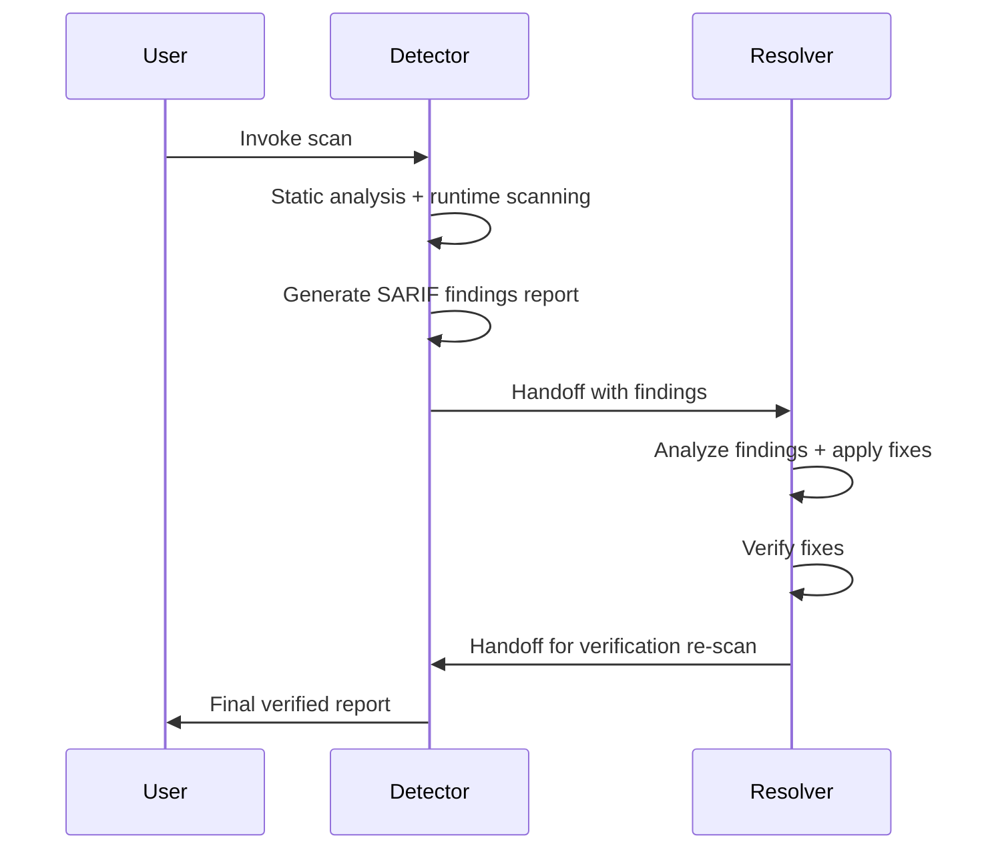

## Agent File Specification

### File Naming

Agent files use one of two naming conventions:

- `AGENT-NAME.md` (simple form)
- `AGENT-NAME.agent.md` (explicit form)

Both forms are equivalent. Use lowercase with hyphens for multi-word names (for example, `security-agent.md` or `a11y-detector.agent.md`).

### Prompt Length

The maximum prompt length for a custom agent is **30,000 characters**. This includes YAML frontmatter and the full body content.

### Cross-Platform Compatibility

The same `.agent.md` file works across VS Code, GitHub.com (coding agent and agents tab), GitHub CLI, and JetBrains IDEs. Omitting the `target` field in YAML frontmatter enables cross-platform support.

## YAML Frontmatter Schema

Every agent file begins with YAML frontmatter enclosed in triple-dash delimiters.

```yaml
---
name: AgentName
description: "One-line description of agent purpose"
model: Claude Sonnet 4.5 (copilot)    # Optional: pin a specific model
tools:                                  # Extensive tool whitelist
  - vscode/getProjectSetupInfo
  - execute/runInTerminal
  - read/readFile
  - read/problems
  - edit/editFiles
  - edit/createFile
  - search/codebase
  - search/textSearch
  - search/fileSearch
  - web/fetch
  - web/githubRepo
  - agent/runSubagent
  - todo
handoffs:                              # Optional: agent-to-agent workflow
  - label: "Fix Issues"
    agent: ResolverAgentName
    prompt: "Fix the issues identified above"
    send: false
---
```

### Field Reference

| Field | Required | Description |
|---|---|---|
| `name` | Yes | PascalCase identifier used to invoke the agent |
| `description` | Yes | One-line summary of the agent's purpose |
| `model` | No | Pins a specific model for consistent behavior |
| `tools` | No | Array of tool namespace references the agent may use |
| `handoffs` | No | Defines agent-to-agent delegation with label, target agent, prompt, and send flag |

## Tool Namespace Reference

Agents declare tool access through namespaced identifiers. The following table lists the available namespaces.

| Namespace | Example Tools | Purpose |
|---|---|---|
| `vscode/` | `getProjectSetupInfo` | VS Code workspace information |
| `execute/` | `runInTerminal` | Terminal command execution |
| `read/` | `readFile`, `problems` | File reading and diagnostics |
| `edit/` | `editFiles`, `createFile` | File creation and modification |
| `search/` | `codebase`, `textSearch`, `fileSearch` | Code and text search |
| `web/` | `fetch`, `githubRepo` | Web fetching and GitHub repository access |
| `agent/` | `runSubagent` | Sub-agent delegation |
| `todo` | (standalone) | Task tracking |

## Body Structure Pattern

The agent body follows a consistent structure across all domains.

1. Expert persona introduction paragraph defining the agent's role and expertise
2. Core responsibilities as a bullet list
3. Domain-specific sections with checklists, rules, and examples
4. Output format specification (Markdown report templates with file paths)
5. Review process as numbered steps
6. Severity classification (CRITICAL, HIGH, MEDIUM, LOW)
7. Reference standards (links to authoritative sources)
8. Invocation section ("Exit with a complete report. Do not wait for user input.")

### Example Persona Opening

> You are a senior security architect with deep expertise in ASP.NET Core, Azure cloud infrastructure, CI/CD pipelines, and supply chain security. You perform comprehensive security assessments and produce actionable remediation reports.

## Detector and Resolver Handoff Pattern

The Accessibility and Code Quality domains use a paired agent architecture where a Detector agent identifies issues and a Resolver agent fixes them.

### Workflow



### Detector Agent Responsibilities

- Scope the analysis target (files, URLs, components)
- Perform static analysis of source files
- Run runtime scanning tools (for example, `npx a11y-scan` for accessibility)
- Generate structured findings grouped by severity
- Handoff to the paired Resolver agent

### Resolver Agent Responsibilities

- Read the Detector's findings report
- Analyze root causes and select appropriate fixes
- Apply code changes following framework-specific patterns
- Verify fixes by re-running relevant checks
- Handoff back to the Detector for a verification scan

### YAML Handoff Configuration

The Detector agent declares the handoff in its frontmatter:

```yaml
handoffs:
  - label: "Fix Issues"
    agent: A11yResolver
    prompt: "Fix the accessibility issues identified above"
    send: false
```

The Resolver agent declares the return handoff:

```yaml
handoffs:
  - label: "Verify Fixes"
    agent: A11yDetector
    prompt: "Re-scan to verify the applied fixes"
    send: false
```

## Organization-Wide Sharing via .github-private

Agents, instructions, and prompts share across an organization through the `.github-private` repository.

```text
.github-private/
  agents/              <-- Organization-wide agents (released)
    security-agent.md
    a11y-detector.agent.md
    ...
  instructions/        <-- Organization-wide instructions
    wcag22-rules.instructions.md
    a11y-remediation.instructions.md
  prompts/             <-- Reusable prompt templates
    a11y-scan.prompt.md
    a11y-fix.prompt.md
```

### Testing Workflow

1. Create the agent in `.github-private/.github/agents/` (repo-scoped for testing)
2. Test the agent against target repositories
3. Move the agent to `.github-private/agents/` (org-scoped for release)
4. Merge to the default branch to activate organization-wide

## Agent Deployment Model

Custom agents deploy at four levels with lowest-level-wins precedence.

| Level        | Location                                  | Availability                  |
|--------------|-------------------------------------------|-------------------------------|
| Enterprise   | `agents/` in enterprise `.github-private` | All enterprise repos          |
| Organization | `agents/` in org `.github-private`        | All org repos                 |
| Repository   | `.github/agents/` in the repo             | That repo only                |
| User profile | `~/.copilot/agents/`                      | All user workspaces (VS Code) |

## Complementary Customization Artifacts

Agents work alongside other customization artifacts to form a complete governance system.

| Artifact | Purpose | Location | Trigger |
|---|---|---|---|
| Custom Instructions (`.instructions.md`) | Always-on rules for files matching `applyTo` globs | `.github/instructions/` | Automatic |
| Prompt Files (`.prompt.md`) | Reusable task templates with input variables | Project directories | Manual reference |
| Agent Skills (`SKILL.md`) | On-demand domain knowledge loaded progressively | `.github/skills/` | Automatic by model |
| `copilot-instructions.md` | Repo-wide custom instructions | `.github/` | Automatic |

### When to Use Each Artifact

- Use **agents** when you need a specialized persona with defined tools and autonomous workflow.
- Use **instructions** when you need always-on rules that apply to specific file patterns (for example, WCAG rules for TSX files).
- Use **prompts** when you need reusable task templates that users invoke manually.
- Use **skills** when you need progressive domain knowledge that the model loads on demand.
- Use **copilot-instructions.md** for repo-wide conventions that apply to all interactions.

## Security Agent Design Patterns

The proven security agents from `.github-private` follow these patterns:

- Model pinning: All agents pin `model: Claude Sonnet 4.5 (copilot)` for consistent behavior.
- Comprehensive tool declarations: Approximately 40 tools per agent covering all namespaces.
- Autonomous execution: Agents complete analysis and exit with a full report without requiring user interaction.
- Severity framework: Consistent CRITICAL, HIGH, MEDIUM, LOW classification with CWE and OWASP mapping.
- PR-ready output: Unified diff patches, fix packs, and change justification checklists.
- Compliance mapping: CIS Azure, NIST 800-53, Azure Security Benchmark, PCI-DSS references.

## References

- [GitHub Custom Agents Documentation](https://docs.github.com/en/copilot/customizing-copilot/adding-custom-agents)
- [OWASP Top 10](https://owasp.org/www-project-top-ten/)
- [WCAG 2.2](https://www.w3.org/TR/WCAG22/)
