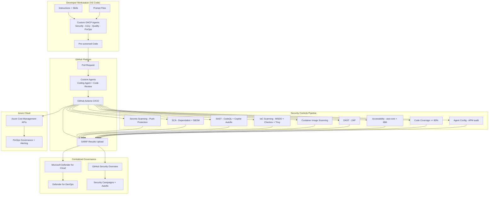

## Core Formula

The framework operates on a single unifying equation:

**Agentic Accelerator = GitHub Advanced Security + GitHub Copilot Custom Agents + Microsoft Defender for Cloud**

GitHub is the preferred platform. Azure DevOps is a first-class citizen.

## Shift-Left Then Scale

The framework follows a four-step principle that moves quality gates as close to the developer as possible and then scales enforcement across the organization.

1. **Shift Left**: Custom GitHub Copilot (GHCP) agents run in VS Code before commit and on the GitHub platform during pull request review.
2. **Automate**: CI/CD pipelines (GitHub Actions and Azure DevOps Pipelines) run the same controls as automated gates.
3. **Report**: All findings output SARIF v2.1.0 for unified consumption through GitHub Code Scanning and ADO Advanced Security.
4. **Govern**: Security Overview, Defender for Cloud, Defender for DevOps, and Power BI dashboards provide centralized governance.

## Architecture Diagram



## Agent Domain Categories

The framework organizes 15 agents into four domains, each producing SARIF-compliant output for centralized governance.

| Domain        | Agents                                                                                                         | SARIF Category         | Reference Repository    |
|---------------|----------------------------------------------------------------------------------------------------------------|------------------------|-------------------------|
| Security      | SecurityAgent, SecurityReviewerAgent, SecurityPlanCreator, PipelineSecurityAgent, IaCSecurityAgent, SupplyChainSecurityAgent (6) | `security/`            | `.github-private`       |
| Accessibility | A11yDetector, A11yResolver (2)                                                                                 | `accessibility-scan/`  | `accessibility-scan-demo-app` |
| Code Quality  | CodeQualityDetector, TestGenerator (2)                                                                         | `code-quality/coverage/` | This repository       |
| FinOps        | CostAnalysisAgent, FinOpsGovernanceAgent, CostAnomalyDetector, CostOptimizerAgent, DeploymentCostGateAgent (5) | `finops-finding/v1`    | `cost-analysis-ai`      |

## Four-Level Deployment Model

Custom agents deploy at four levels with lowest-level-wins precedence.

| Level        | Location                                  | Availability                  |
|--------------|-------------------------------------------|-------------------------------|
| Enterprise   | `agents/` in enterprise `.github-private` | All enterprise repos          |
| Organization | `agents/` in org `.github-private`        | All org repos                 |
| Repository   | `.github/agents/` in the repo             | That repo only                |
| User profile | `~/.copilot/agents/`                      | All user workspaces (VS Code) |

The same `.agent.md` file works in VS Code, GitHub.com coding agent, GitHub CLI, and JetBrains IDEs. Omitting the `target` field enables cross-platform support.

## SARIF v2.1.0 as Universal Interchange Format

All scan tools in the framework output SARIF v2.1.0 and upload results to GitHub Code Scanning or ADO Advanced Security. This creates a single pane of glass for security, accessibility, code quality, and cost findings.

Requirements for GitHub consumption:

- `$schema` and `version: '2.1.0'` (required)
- `tool.driver.name` and `tool.driver.rules[]` (required)
- `help.text` (required); `help.markdown` (recommended)
- `partialFingerprints` for deduplication (required)
- `automationDetails.id` with domain category prefix (recommended)

Limits: 10 MB gzip compressed, 25,000 results per run, 20 runs per file.

## Dual-Platform Data Flows

### GitHub Path

```text
Scan Tools --> SARIF Upload --> GitHub Code Scanning --> Security Overview
                                                       |
                                          Defender for Cloud (GitHub Connector)
                                                       |
                                          Defender for DevOps Console
```

### Azure DevOps Path

```text
Pipeline Tasks --> SARIF --> ADO Advanced Security --> ADO Security Overview (UI)
                                                     |
                                        Defender for Cloud (ADO Connector)
                                                     |
                                        Defender for DevOps Console
                                                     |
                              Power BI AdvSec Report (advsec-pbi-report-ado)
```

### Complementary Dashboards

| Dashboard | Platform | Capabilities | Gaps Addressed |
|---|---|---|---|
| GitHub Security Overview | GitHub | Org-wide alerts, filter by severity/rule/category, Security Campaigns | Full-featured |
| ADO Security Overview | ADO | Org-level risk and coverage tabs | UI-only, no API, limited customization |
| Power BI AdvSec Report | ADO | Star schema, DAX measures, multi-org, trend analysis, Mean Time to Fix | Compensates for ADO Security Overview API gap |
| Defender for Cloud | Both | Unified cross-platform view, attack path analysis, runtime protection | Aggregates both platforms |
| Defender for DevOps | Both | DevOps-specific findings across GitHub, ADO, and GitLab | Cross-platform visibility |

## References

- [SARIF v2.1.0 Specification](https://docs.oasis-open.org/sarif/sarif/v2.1.0/sarif-v2.1.0.html)
- [OWASP Top 10](https://owasp.org/www-project-top-ten/)
- [WCAG 2.2](https://www.w3.org/TR/WCAG22/)
- [CIS Azure Benchmarks](https://www.cisecurity.org/benchmark/azure)
- [GitHub Code Scanning](https://docs.github.com/en/code-security/code-scanning)
- [Microsoft Defender for Cloud](https://learn.microsoft.com/en-us/azure/defender-for-cloud/)
