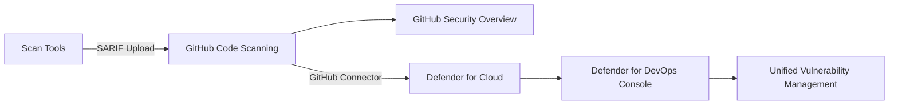
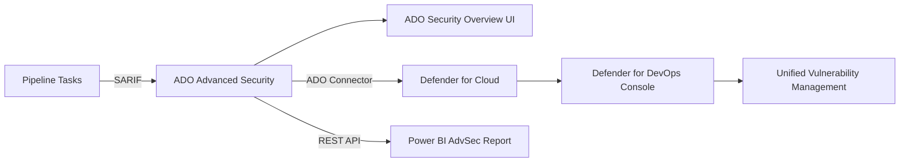
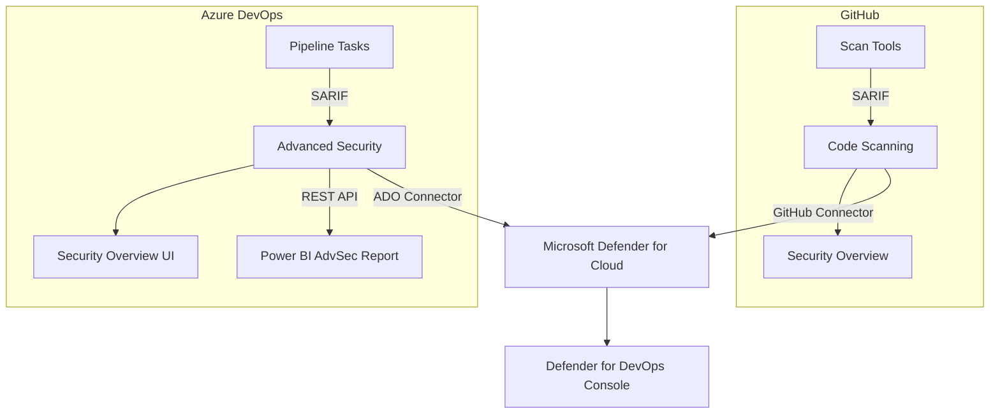

## Overview

The Agentic Accelerator Framework operates across GitHub and Azure DevOps. Centralized governance requires aggregating security findings from both platforms into unified dashboards. This document covers the data flow architecture, platform-specific capabilities, complementary dashboards, and integration requirements.

## Dual-Platform Data Flow

Security findings flow from scan tools through platform-specific pipelines into centralized dashboards. Both paths converge at Microsoft Defender for Cloud for unified visibility.

### GitHub Path



### Azure DevOps Path



### Combined Architecture



## GitHub Security Overview

GitHub Security Overview provides organization-wide visibility into code scanning alerts across all repositories.

### Capabilities

- **Organization-wide dashboard** with alert aggregation across repositories
- **Filtering** by severity, rule, category (tag-based via SARIF `properties.tags`)
- **API access** for programmatic querying and custom reporting
- **Risk and coverage views** showing enablement status and alert distribution

### Security Campaigns

Security Campaigns enable bulk remediation of vulnerabilities across an organization:

- Select alerts matching specific criteria (severity, rule, category)
- Assign remediation targets to teams or individuals
- Track progress through a campaign-specific dashboard
- Leverage Copilot Autofix for AI-powered fix suggestions on supported alert types

### Copilot Autofix

Copilot Autofix generates fix suggestions directly within code scanning alerts:

- Automatic fix proposals for CodeQL-detected vulnerabilities
- Inline diff preview in the alert detail view
- One-click PR creation to apply suggested fixes
- Available for both push protection blocks and existing alerts

## ADO Security Overview

ADO Security Overview provides organization-level risk and coverage visibility, though with notable limitations compared to GitHub.

### ADO Capabilities

- **Organization-level and project-level dashboards** with risk and coverage tabs
- **Alert aggregation** across repositories within a project
- **Inline PR annotations** through build validation policies

### Limitations

- **UI-only** with no API access for custom reporting or automation
- Limited customization of views and filtering compared to GitHub
- No Security Campaigns or Copilot Autofix equivalents

These limitations are compensated by the Power BI AdvSec Report (described below), which provides richer analytics through the ADO Advanced Security REST API.

## Microsoft Defender for Cloud

Microsoft Defender for Cloud aggregates security findings from both platforms into a unified posture management dashboard.

### Defender for Cloud Capabilities

- **Cross-platform DevOps insights** across GitHub, Azure DevOps, and GitLab
- **GenAI workload protection** for AI-powered applications
- **Attack path analysis** for identifying misconfigurations and vulnerability chains
- **Runtime protection** with cloud workload protection plans
- **Regulatory compliance dashboards** mapped to industry standards

### DevOps Security Posture

After connecting GitHub and ADO organizations, Defender for Cloud ingests:

- Code scanning alerts (CodeQL, custom SARIF)
- Dependency scanning alerts
- Secret scanning alerts
- IaC scanning results (Terraform, Bicep, Kubernetes)
- Accessibility and code quality SARIF findings published to Advanced Security

## Defender for DevOps Console

The Defender for DevOps console provides a DevOps-specific view within Microsoft Defender for Cloud.

### Defender for DevOps Capabilities

- **Unified vulnerability management** across GitHub, ADO, and GitLab repositories
- **Repository inventory** with security posture scores
- **Finding correlation** between code-level vulnerabilities and runtime exposure
- **Connector health monitoring** to verify data ingestion status

### Cross-Platform Visibility

Defender for DevOps shows findings from all connected DevOps platforms in a single view, enabling governance teams to compare security posture across organizations that use different source control platforms.

## Complementary Dashboards

No single dashboard covers all governance needs. The following five dashboards work together to provide complete visibility.

| Dashboard | Platform | Capabilities | Gaps Addressed |
| --------- | -------- | ------------ | -------------- |
| GitHub Security Overview | GitHub | Org-wide alerts, filter by severity/rule/category, Security Campaigns, Copilot Autofix, API access | N/A (full-featured for GitHub) |
| ADO Security Overview | ADO | Org-level risk and coverage tabs, PR annotations | UI-only, no API, limited customization |
| Power BI AdvSec Report | ADO | Star schema analytics, DAX measures, multi-org support, trend analysis, Mean Time to Fix | Compensates for ADO Security Overview API gap |
| Defender for Cloud | Both | Unified cross-platform view, attack path analysis, runtime protection, compliance dashboards | N/A (aggregates both platforms) |
| Defender for DevOps | Both | DevOps-specific findings across GitHub, ADO, and GitLab | N/A (cross-platform DevOps view) |

## Integration Requirements

### GitHub Requirements

- GitHub Advanced Security (GHAS) enabled, or public repository
- Organization connected to Defender for Cloud via the GitHub connector
- `security-events: write` permission in CI workflows for SARIF upload
- SARIF files compliant with GitHub Code Scanning requirements

### Azure DevOps Requirements

- GitHub Advanced Security for Azure DevOps (GHAzDO) enabled
- Organization connected to Defender for Cloud via the ADO connector
- Pipeline tasks for scanning: `AdvancedSecurity-Codeql-Init@1`, `AdvancedSecurity-Codeql-Analyze@1`, `AdvancedSecurity-Dependency-Scanning@1`
- Custom SARIF publishing via `AdvancedSecurity-Publish@1` task
- PAT with `vso.advsec` scope for Power BI report data access

### Connector Permissions

- **GitHub connector**: Requires organization admin to authorize the Defender for Cloud GitHub app
- **ADO connector**: Requires project collection admin to configure the ADO organization connection
- Both connectors must be verified as "Connected" in the Defender for Cloud environment settings

## Power BI AdvSec Report for ADO

The `devopsabcs-engineering/advsec-pbi-report-ado` repository provides a Power BI report in PBIP format that delivers the analytics capability ADO Security Overview lacks natively.

### Architecture

- **Data source**: ADO Advanced Security REST API at `advsec.dev.azure.com` (API v7.2-preview.1)
- **Authentication**: PAT with `vso.advsec` scope
- **Data model**: Star schema with 1 fact table (`Fact_SecurityAlerts`) and 5 dimension tables (`Dim_AlertType`, `Dim_Date`, `Dim_Repository`, `Dim_Severity`, `Dim_State`)
- **Parameters**: `OrganizationName` and optional `ProjectName` for multi-org deployment
- **Pagination**: Continuation token-based enumeration across all projects, repos, and alerts

### Report Pages

- **Security Overview**: DevOps Security Findings donut charts, Code Scanning/Dependency/Secret finding breakdowns, severity distribution, alerts by tool
- **Alerts by Type**: Breakdown by dependency, secret, and code alerts
- **Trend Analysis**: Alert trends over time with historical comparison

### Key Metrics (DAX Measures)

- Total Alerts, Active Alerts, Fixed Alerts, Fixed Rate %
- Critical Active count
- Mean Time to Fix
- Alert counts segmented by type: Dependency Alerts, Secret Alerts, Code Alerts

### Deployment

```powershell
# Configure for your ADO organization
.\scripts\setup-parameters.ps1 -OrganizationName "yourorg"

# Open in Power BI Desktop
Start-Process AdvSecReport.pbip

# Automated deployment to Fabric workspace
.\scripts\deploy.ps1
```

### Governance Value

The Power BI report provides "Security Overview at scale" for ADO, enabling governance teams to assess security posture across dozens of projects and repositories. Combined with Defender for Cloud, this creates comprehensive security governance for ADO-hosted repositories that matches the analytical depth available natively on GitHub.

## References

- [GitHub Security Overview documentation](https://docs.github.com/en/code-security/security-overview)
- [Microsoft Defender for Cloud DevOps security](https://learn.microsoft.com/en-us/azure/defender-for-cloud/defender-for-devops-introduction)
- [GHAzDO Advanced Security](https://learn.microsoft.com/en-us/azure/devops/repos/security/github-advanced-security-overview)
- [advsec-pbi-report-ado](https://github.com/devopsabcs-engineering/advsec-pbi-report-ado)
