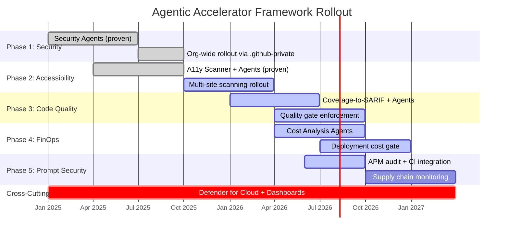
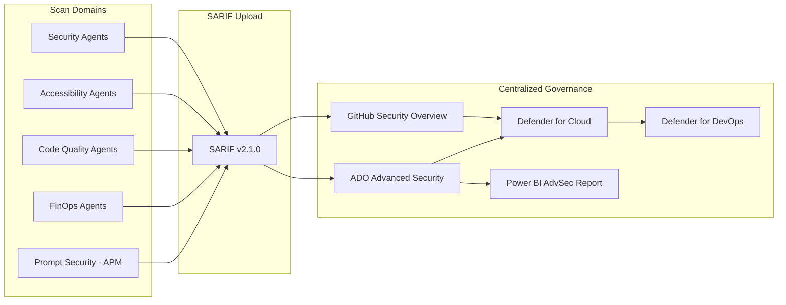

## Roadmap Overview

The framework rolls out across five phases, each introducing a new agent domain. Phases 1 and 2 leverage proven implementations. Phases 3 through 5 build on established patterns with new agent definitions. Cross-cutting centralized governance applies to all phases.

## Phase 1: Security Agents

| Attribute | Detail |
|---|---|
| Status | Implemented |
| Repository | `devopsabcs-engineering/.github-private` |
| Agents | SecurityAgent, SecurityReviewerAgent, SecurityPlanCreator, PipelineSecurityAgent, IaCSecurityAgent, SupplyChainSecurityAgent |
| SARIF Category | `security/` |

### Proof of Value

Demonstrated at the TT343 session ("Agentic AI for DevSecOps: Transforming Security with GHAS and GHCP") with a live demo using the `gh-advsec-devsecops` repository. Six custom agents produced actionable security reports covering OWASP Top 10, CIS Azure benchmarks, pipeline hardening, IaC misconfiguration, and supply chain risks.

### Actions

- Roll out organization-wide via `.github-private`
- Enable in VS Code for pre-commit scanning
- Configure CI SARIF upload to GitHub Code Scanning

## Phase 2: Accessibility Agents

| Attribute | Detail |
|---|---|
| Status | Implemented |
| Repository | `accessibility-scan-demo-app` (scanner), `.github-private` (agents) |
| Agents | A11yDetector, A11yResolver |
| SARIF Category | `accessibility-scan/` |

### Proof of Value

A three-engine accessibility scanner (axe-core, IBM Equal Access, custom Playwright checks) produces SARIF output compliant with WCAG 2.2 Level AA. The scanner integrates with GitHub Actions for CI gating and uploads results to Code Scanning. Findings flow through to Defender for Cloud for centralized governance.

The Detector and Resolver agent pair demonstrates the handoff pattern: the Detector identifies violations using static and runtime analysis, hands off to the Resolver for automated remediation, and then re-scans for verification.

### Actions

- Onboard additional applications for accessibility scanning
- Add scheduled production URL scans via cron workflows
- Expand custom Playwright checks based on organizational patterns

## Phase 3: Code Quality Agents

| Attribute | Detail |
|---|---|
| Status | Active — agents defined, coverage gate implemented |
| Agents | CodeQualityDetector, TestGenerator |
| SARIF Category | `code-quality/coverage/` |

### Proof of Value

A coverage gate that fails the CI pipeline when code coverage drops below 80% for any file or function. Below-threshold functions are reported as SARIF results, appearing in GitHub Code Scanning alongside security and accessibility findings. The Test Generator agent reads uncovered functions and produces tests covering happy path and error paths.

### Implementation Pattern

Follows the Detector and Resolver pattern from Accessibility:

1. Code Quality Detector reads coverage reports (lcov, cobertura, JSON)
2. Identifies files and functions below the 80% threshold
3. Reports findings as SARIF with `ruleId` values: `uncovered-function`, `uncovered-branch`, `coverage-threshold-violation`
4. Hands off to Test Generator for automated test creation
5. Re-measures coverage after test generation

### Multi-Language Coverage Tools

| Language | Tool | Formats |
|---|---|---|
| JavaScript/TypeScript | Vitest, Jest, c8, Istanbul | lcov, cobertura, JSON |
| Python | coverage.py, pytest-cov | lcov, XML, JSON |
| .NET/C# | dotnet test + coverlet | cobertura, opencover, lcov |
| Java | JaCoCo, Cobertura | XML, HTML, CSV |
| Go | `go test -coverprofile` | Go cover profile to lcov |

### Actions

- Agent definitions (`code-quality-detector.agent.md` and `test-generator.agent.md`) are in place
- Roll out organization-wide via `.github-private` using `deploy-to-github-private.yml`
- Refine coverage-to-SARIF converter
- Enforce quality gate workflow (`code-quality.yml`) in CI

## Phase 4: FinOps / Cost Analysis Agents

| Attribute | Detail |
|---|---|
| Status | Active — agents defined, cost gate workflow implemented |
| Agents | CostAnalysisAgent, FinOpsGovernanceAgent, CostAnomalyDetector, CostOptimizerAgent, DeploymentCostGateAgent |
| SARIF Category | `finops-finding/v1` |

### Proof of Value

A deployment cost gate that blocks infrastructure changes exceeding the defined budget. The agent queries Azure Cost Management APIs, evaluates proposed IaC changes against budget constraints, and produces SARIF findings for budget overspend, cost anomalies, untagged resources, and optimization opportunities. Findings appear in Code Scanning alongside security alerts.

### Azure Cost Management API Integration

| API | Purpose |
|---|---|
| Cost Management Query | Ad-hoc cost queries by tag, resource group, or service |
| Budgets | Create and manage cost budgets with alerts |
| Exports | Recurring CSV to Azure Storage |
| Scheduled Actions | Anomaly detection alert rules |
| Forecasts | Project future costs |
| Azure Advisor | Optimization recommendations |

### Actions

- Five agent definitions are in place in `agents/`
- Roll out organization-wide via `.github-private` using `deploy-to-github-private.yml`
- Integrate with Azure Cost Management SDK
- Enforce deployment cost gate via `finops-cost-gate.yml` workflow
- Implement repository-to-cost attribution through `ProjectName` tagging

## Phase 5: Prompt File Security

| Attribute | Detail |
|---|---|
| Status | Active — APM audit workflow implemented, CODEOWNERS protection in place |
| Key Tool | APM (Agent Package Manager) by Daniel Meppiel |
| SARIF Category | `agent-config-scan/` |

### Proof of Value

APM's `apm audit` command detects hidden Unicode characters (zero-width spaces, bidi overrides, tag characters, Glassworm attack vectors) embedded in agent configuration files. The `microsoft/apm-action` GitHub Action integrates this scanning into CI/CD, blocking compromised agent configurations before they reach production. Combined with CODEOWNERS protection for agent config directories, this creates defense-in-depth for the AI supply chain.

### APM Content Security Scanning

| Severity | Detections |
|---|---|
| Critical | Tag characters (U+E0001 to U+E007F), bidi overrides (U+202A to U+202E, U+2066 to U+2069), variation selectors 17 to 256 (Glassworm attack vector) |
| Warning | Zero-width spaces/joiners, variation selectors 1 to 15, bidi marks, invisible operators, annotation markers, deprecated formatting, soft hyphen, mid-file BOM |
| Info | Non-breaking spaces, unusual whitespace, emoji presentation selector |

### OWASP LLM Top 10 Alignment

| OWASP Risk | Relevance |
|---|---|
| LLM01 Prompt Injection | Malicious instructions in config files |
| LLM03 Supply Chain | Config files are part of the LLM supply chain |
| LLM06 Excessive Agency | Config files define tool access and autonomy level |
| LLM07 System Prompt Leakage | Config files are system prompts; leaked configurations expose architecture |

### Actions

- `apm.yml` manifest and `apm-security.yml` workflow are in place
- `.github/CODEOWNERS` enforces security-team review for agent config paths
- Run `apm audit` as a pre-commit check in VS Code
- Expand supply chain monitoring coverage

## Cross-Cutting: Centralized Governance

Centralized governance applies across all five phases and ensures findings from every domain flow into a unified view.

### Components

| Component | Role |
|---|---|
| GitHub Security Overview | Org-wide dashboard of all Code Scanning alerts, filtered by SARIF category |
| Microsoft Defender for Cloud | Unified security posture across GitHub, ADO, and runtime environments |
| Defender for DevOps | DevOps-specific findings console across GitHub, ADO, and GitLab |
| Power BI AdvSec Report | Compensates for ADO Security Overview API gap with star schema analytics |
| Security Campaigns | Bulk remediation of vulnerabilities with Copilot Autofix (GitHub-only) |

### Integration Requirements

- GitHub Advanced Security (GHAS) enabled on all repositories
- GitHub organization connected to Defender for Cloud via GitHub connector
- ADO organization connected to Defender for Cloud via ADO connector (for hybrid environments)
- Unified SARIF categories configured across all scan types (see the [SARIF Integration Reference](sarif-integration.md))
- `security-events: write` permission in CI workflows

### Governance Data Flow

## References

- [docs/architecture.md](architecture.md): Framework architecture and core formula
- [docs/agent-patterns.md](agent-patterns.md): Agent authoring reference
- [docs/sarif-integration.md](sarif-integration.md): SARIF category registry and domain mappings
- [docs/platform-comparison.md](platform-comparison.md): GitHub vs ADO feature matrix
- [Microsoft APM (Agent Package Manager)](https://github.com/microsoft/apm)
- [Microsoft Defender for Cloud](https://learn.microsoft.com/en-us/azure/defender-for-cloud/)
